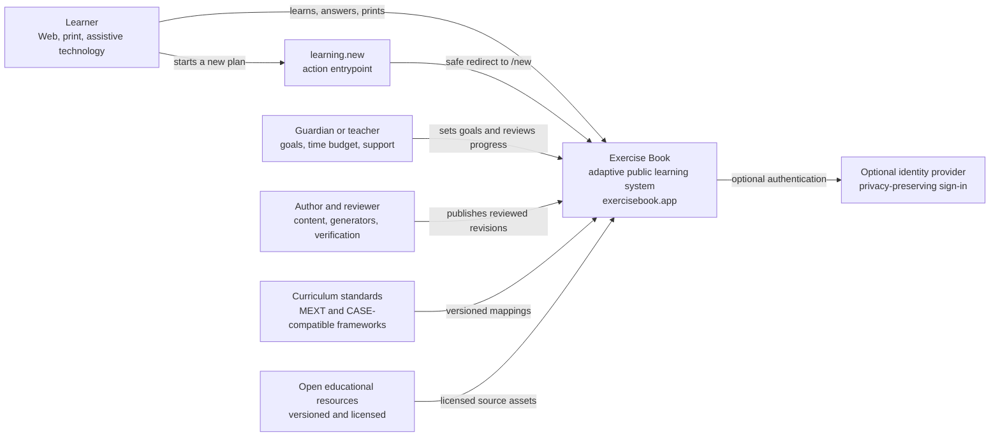
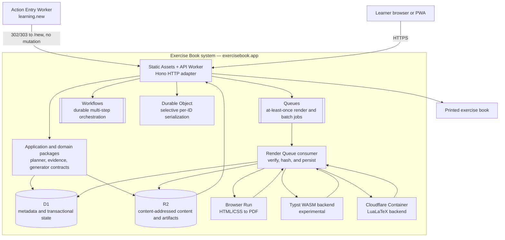
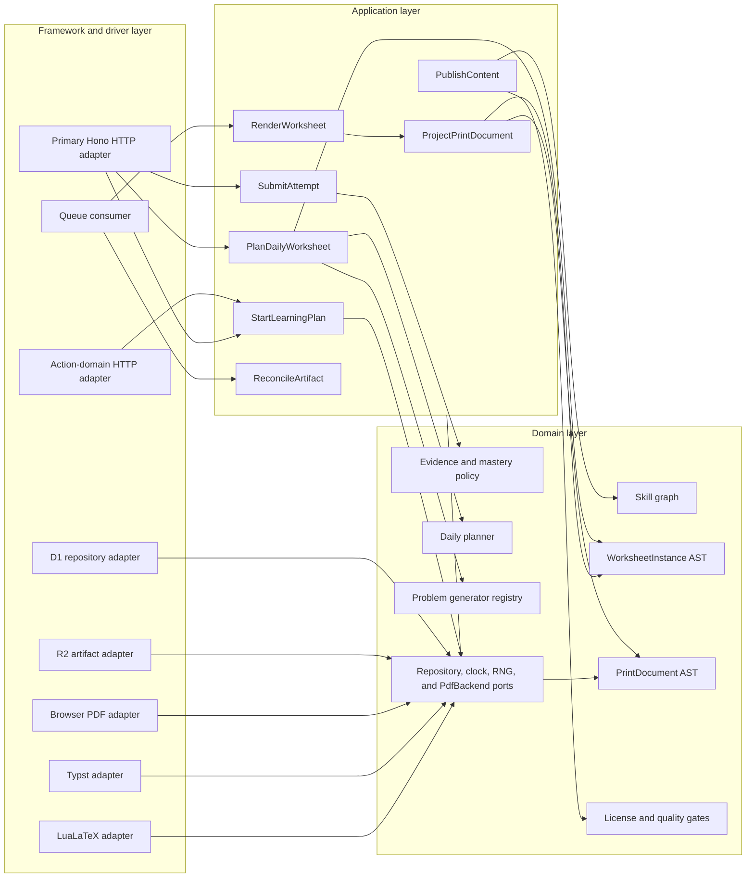
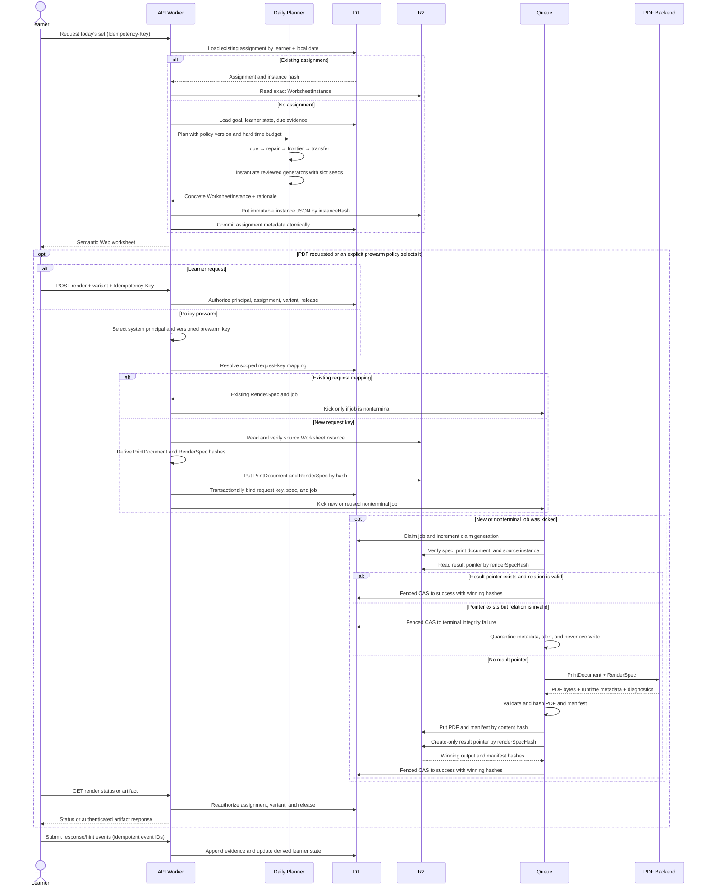
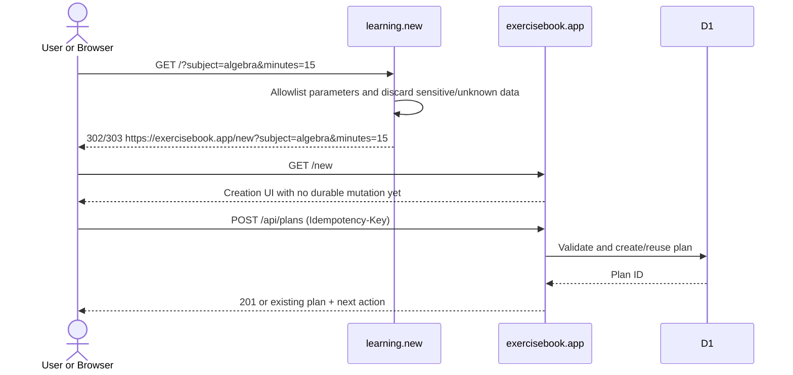
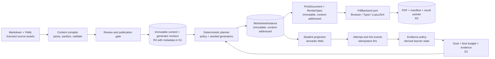

# Exercise Book architecture

Status: proposed foundation with local implementation checkpoints

Date: 2026-08-02

This is a target architecture, not a deployment record. The Phase 1 repository
implements a local walking skeleton through printable A4 HTML, Phase 1.5 adds
an anonymous deterministic daily-plan preview, and the current Phase 1.7 stack
adds a strict V2 worksheet-preview backend, renderer-neutral `PrintDocumentV2`
semantic core, trusted prepared-answer guard, deterministic printable V2 HTML,
semantic snapshots, and a content-addressed local sample-artifact lane beside
the preserved V1 lane. It does not claim production DNS/application deployment,
durable Cloudflare storage, learner adaptation, a hosted PDF service, Browser
Run rendering, a LuaLaTeX backend, a standalone lesson, or a V2 React
experience.

Primary application: `https://exercisebook.app`

Action entrypoint: `https://learning.new`

Decision record: [ADR-0001](decisions/0001-core-architecture.md)

### Current implemented boundary

The local slice is intentionally smaller than the target containers below.
`@exercisebook/planner` is a pure, version-pinned policy package. The Hono
Worker application service composes that policy with reviewed content, the
deterministic fraction generator, an integrity check, and a strict student-only
Web projection. `POST /api/plans/preview` dispatches exact V1 requests only to
the preserved V1 response lane and exact V2 requests only to the new
`web-worksheet.v2` response lane. It returns an unsaved set for one reviewed
goal and an 8-, 12-, or 20-minute practice cap; it does not infer a version
from optional fields or ambient configuration.

The current preview has no repository or Cloudflare storage adapter, accepts no
learner identity or evidence, writes no cookie or browser storage, and does not
claim mastery or adaptation. Its sequence seed is internal to materialization;
the public response exposes only the preview identity, pinned public
provenance, selection reason, counts, minutes, and student worksheet. The
active React `/new` experience still requests and renders V1. The V2 Web DTO,
trusted projector, service, HTTP route, print semantic core, printable HTML,
semantic snapshots, and local sample-artifact bundle remain contract and
verification work; standalone lesson delivery and React V2 integration remain
open. The current local browser and A4 checks are renderer evidence, not an
approved product/visual direction or a hosted rendering service. The preserved
executable V1 contract is
[Daily Plan Preview v1](../specs/daily-plan-preview-v1.md).

The V2 lane uses `day-one-fraction-preview@3`, pinned to the immutable V2
content identity and the selected lesson, worked-example, and exercise nodes.
Its `WorksheetInstanceV2` hash commits the renderer-neutral selected
presentation, and detached `StudentWorksheetDeliveryV2` authorization removes
answer authority before the strict Web DTO is projected.

The parallel print lane uses schema `exercisebook.print/v2`, source schema
`exercisebook.worksheet-instance/v2`, and projector `print-projector.v2`.
Separate student and answer-key entrypoints verify and detach one materialized
instance, preserve its source instance hash, and produce distinct canonical
document hashes. Student and common answer-key blocks are built only from
`StudentWorksheetDeliveryV2`; answer-bearing key entries are appended only from
the same detached full-instance snapshot. The fixed `paper: "a4"` value
participates in the semantic document identity. By itself that discriminator is
not layout evidence; rendered acceptance is recorded separately below.

`printable-html.v2` validates and detaches the complete `PrintDocumentV2`
before rendering deterministic, self-contained student or answer-key HTML. Its
public semantic observation contract is
`exercisebook.print-semantic-snapshot/v2`. The default 16,000,000-byte exact
UTF-8 output cap and 65,536-emitted-element cap are renderer-module protective
bounds, not Cloudflare Worker memory, latency, concurrency, or request SLOs.
The reviewed validator-maximal element/cardinality fixture renders 814 blocks
as 59,046 elements and 2,493,161 UTF-8 bytes, leaving 6,490 elements of
headroom. That byte count belongs to this fixture; it does not claim that every
authored text field can simultaneously be at its maximum length.

The local V2 sample lane materializes one pinned 12-minute plan and writes nine
content-addressed artifacts plus an exact manifest: the compiled content
document, daily plan, worksheet instance, student and answer-key
`PrintDocumentV2` objects, their semantic snapshots, and their printable HTML.
Before loading the generation pipeline, that lane captures its fixed Markdown
source through a nonfollowing, nonblocking regular-file descriptor. The read is
bounded at 262,144 bytes, requires fatal UTF-8 decoding, and requires size,
modification time, and change time to remain stable through the read. A
symbolic link, FIFO, oversized source, invalid UTF-8, or concurrently changed
source fails before artifact publication begins.
Publication is immutable and no-clobber; verification checks the exact file
set, names, sizes, hashes, manifest relationships, projection parity, protected
answer fields, and self-contained HTML. This is a checked-in developer
fixture—not an R2 object, a public API payload, or production artifact storage.
The publisher and verifier assume a trusted, developer-controlled output
directory and ancestor path. Their no-follow, nonblocking, descriptor-bounded,
exact-byte checks protect against common mistakes and special files; they are
not dirfd-anchored against hostile ancestor replacement, do not provide a
directory-fsync crash-durable transaction, and do not support concurrent writers
targeting one output directory. Independent writers must use separate output
directories.

In the preserved V1 lane, the enabled `day-one-fraction-preview@2` policy
owns every reduced canonical rational structurally exposed by the reviewed
worked example—its
left operand, right operand, and result—as the ordered plan-activity tuple
`[1/2, 1/3, 5/6]`. The example's left/right/result values are derived from that
same tuple. Materialization deterministically advances its retry sequence when
a candidate answer matches any reserved value. As a second, independent
boundary, the Web projector fails closed if any structured rational or
recognized answer-bearing string in the final worked example reveals any
generated practice answer.

The final validated student DTO uses a field-sensitive scan. Global worksheet
fields, prompt instructions, and every non-prompt field of every item are
checked against every canonical practice answer. A structured prompt operand
may legitimately equal another slot's answer, but never its own; prompt
`accessibleText` and accessibility summaries are exact derivations from the
validated operands. This distinction rejects cross-slot leaks in fields such
as `printFallback` without rejecting mathematically valid operand reuse.

Recognized fraction-like strings are also reduced to bounded rational
signatures before comparison. The current recognizer covers slash and Unicode
slash forms, curated division/solidus forms, spaced `over`, `divided by`, and
`division by`, bounded TeX `\frac`, and bounded numerator/denominator
object-like text after the existing normalization closure. At every raw or
URI-decoded state, one scanner-only transform applies NFKC and these reviewed
folds:

- Unicode `Dash_Punctuation` plus U+02D7, U+2043, U+2212, U+2796, and U+10D8F
  to ASCII `-`;
- U+02D6, U+16ED, U+2795, and U+10D8E to ASCII `+`;
- U+00F7, U+2298, U+2571, U+2797, U+27CB, U+29F8, U+2A38, and U+1F67C to
  ASCII `/`;
- Unicode `Default_Ignorable_Code_Point` characters to the empty string.

The explicit sets follow reviewed Unicode sign, division, solidus, and
confusable evidence without treating unrelated letters, punctuation, ratio
operators, or unreviewed or ambiguous decorated math operators as ordinary
unary signs or fractions.
Any `Bidi_Control` fails closed because deleting it cannot reconstruct visual
order. The delivered text is not rewritten, and the transform remains inside
the existing 24-state worklist. Future RTL support must introduce a reviewed
structured-bidi policy rather than weakening this boundary. The recognizer
intentionally does not claim complete detection of decimals, percentages,
ratio/colon notation, cross-script homoglyph spellings of word separators, or
arbitrary natural-language equivalents; answer, candidate, and integer limits
fail closed instead of accepting a partial scan.

Trusted server projectors now prepare one opaque answer guard per authorization
phase. Preparation validates and detaches the canonical answers once, then
builds the complete and per-slot rational-signature sets in O(N). The prepared
API is exported only from `@exercisebook/schemas/trusted-student-projection`;
browser source and emitted-artifact checks reject it. The existing root
one-shot assertion remains behavior-compatible for callers that do not own a
phase, but production Web and Print paths reuse the prepared guard across their
role-sensitive assertions.

Each prepared assertion has one combined 4,096-candidate cap across structured
and recognized-text rationals, and the phase shares an 8,192-candidate cap.
End-to-end production Web or Print projection entrypoints use two fixed
authorization phases; the replay-authorized V2 service path uses three. These
are phase-local fail-closed bounds, not a request-wide deadline, memory limit,
or proof of total CPU safety, so trusted planner/materializer replay still
precedes projection. The schema-valid,
unique-answer boundary benchmark uses 6 candidates in delivery and `12 + 10N`
in the final Print phase. That is `18 + 10N` across the two direct V2 phases:
at N=200, the heavier phase consumes 2,012/8,192 and the two-phase total is
2,018. Prepared trusted/full V2 p50 is 7.13/30.08 ms at N=100 and 13.48/56.63
ms at N=200. These are local Apple M5 Pro / Node 26.5.0 reference measurements
after 3 warmups and across 15 measured runs, not a CI latency or SLO gate.
Deterministic counters and tests are the regression evidence. Structural
instrumentation records `24N + 36` answer-guard BigInt
conversions across trusted delivery and final Print authorization: 4,836 at
N=200 versus the former guard-only 487,636 baseline, about 100.8x fewer. Other
validation and canonicalization BigInt work is outside that structural count.

A separate structural issue was exposed by a broad aggregate-wrapper fixture.
The wrapper `{ instance, canonicalJson, instanceHash }` passes at N=178 and fails at
N=179 because the same semantic material appears both as the instance graph and
as its canonical JSON string while the complete wrapper is inspected against
the existing safe-graph string-code-unit cap. This is not an answer-guard or
renderer failure, and the current planner can emit only 4, 6, or 8 problems, so
the fixture boundary is not reachable through the public preview and is not a
public blocker. The follow-up should independently bound the instance graph and
the canonical UTF-8 string. Do not widen the global safe-graph cap or narrow
schema problem slots without a separate measured contract decision.

The V2 service treats injected dependencies as hostile test seams, not as
alternate authorities. Supplied planner, materializer, and projector outputs
are detached and canonical-compared with independently trusted replay before a
response can be returned. Only trusted planner unavailability and an explicit
allowlist of reviewed presentation/materialization availability codes become
the generic unavailable result. An injected unavailable outcome must match the
trusted replay's exact internal reason; defect-oriented or newly introduced
codes remain exceptions until explicitly reviewed. Unexpected Hono route
failures are reported through a fixed structured event containing only the
route classification and status; the client receives one sanitized, no-store
500 response, and neither the raw exception nor request data is placed in that
report.

Browser privacy is enforced at three independent layers:

1. production browser source may import only exact reviewed public leaf
   subpaths, with their exact transitive dependencies checked;
2. the Vite build inspects final Rollup `OutputChunk.modules` provenance and
   fails if a client chunk contains a server, Worker, generator, or unreviewed
   workspace module; and
3. a post-build canary scans every regular emitted file for protected answer,
   seed, scoring, and solution-trace tokens.

The artifact walk fails closed above 1,000 total entries, 20 MiB of regular-file
content, or depth 16, and rejects symbolic links and non-regular entries. The
token canary is defense in depth, not proof that every equivalent answer or
secret is semantically absent. Tree-shaking is an optimization and is never an
authorization boundary; source reachability and emitted-module provenance must
both remain reviewable.

Production print source has a separate exact dependency allowlist:
`@exercisebook/domain`, `@exercisebook/schemas`, and
`@exercisebook/schemas/trusted-student-projection`, plus relative modules inside
the package. The boundary rejects planner, generator, compiler, unreviewed
subpath, and test-only imports so the projector cannot silently replan,
regenerate, or resolve current content. The package root exports only the
reviewed V2 schema/types, validator, canonicalizer, projection entrypoints, and
materialization verifier. Internal block machinery, direct materialization, and
the final trusted-answer authorization helper remain unexported. Structural
`PrintDocumentV2` validation proves shape and internal consistency; only
projection from a verified, application-authorized worksheet snapshot proves
source binding and student authorization.

This 2026-08-02 local printable-HTML checkpoint is on
`feat/v2-printable-html`, stacked on `feat/prepared-answer-guard` (draft PR #7),
which is itself stacked on the V2 PrintDocument checkpoint (draft PR #6). It is
published as draft PR #8 with base `feat/prepared-answer-guard` and head
`feat/v2-printable-html`. The initial two-commit head
`ddf449364832d96fff57e0b05c2ac0196f6c8157` passed exact-head GitHub CI and was
reported clean and mergeable; the checkpoint remains neither merged nor
deployed. Reviewed content hashes and all five frozen V1
worksheet/PrintDocument/HTML identities remain exact. The fixed V2 worksheet
instance hash is
`934bd3949b6284bbb4061a29b3075560f9389b096ec4f913ad56788e06ac0d02`.
The student PrintDocument hash is
`51892552e00caac748d0ceb2532ed7eb1d7a1e094eef887cb0cc941fd8f80111`
at 12,077 canonical bytes, leaving 3,987,923 bytes below the 4,000,000-byte
cap. The answer-key hash is
`d5a5b226bb485ed8e3cb8a43ef05695015e2a00bb97fe6a85530c654b7db0ebd`
at 16,012 bytes, leaving 3,983,988 bytes.

The exact `printable-html.v2` outputs are 23,436 UTF-8 bytes for the student
variant at
`13b819ad153d7c0d2313d412720390ed9544bebf7033f5588e2baf86fc0a5f39`
and 29,297 bytes for the answer key at
`b49c3812a26b6754d783207d11b4480e20aef112f89087a808b4a60521cb026d`.
The corresponding `exercisebook.print-semantic-snapshot/v2` identities are
`313f7dc135ccbb2bc59967c9f78da8b42f1986136f4a2fb32eedb766ebf54d67`
for the student variant and
`540ae4e7105b030597df2dd0fdfd04b5fb50d562d93d6f71942d45393412d167`
for the answer key.

Real-browser structural checks found no external resource requests, duplicate
IDs, unresolved ARIA references, or unlabeled `role="math"` expressions; each
math visual is hidden from the accessibility tree beside its labeled semantic
representation. Browser-generated CSS-page-size PDFs are A4 at 594.96 by
841.92 points: six student pages and eight answer-key pages. Every page was
visually inspected with no clipping or overlap, and extracted worksheet and
answer-key headings remain in document order. This is local renderer and
structural-accessibility evidence, not a complete WCAG/tagged-PDF audit,
Browser Run evidence, a production PDF SLO, or hosted artifact delivery.

A separate validator-accepted Japanese/long-text probe renders 137,077-byte
student and 590,485-byte answer-key HTML with no horizontal overflow across
117/184 authored text and math surfaces. Its CSS-page-size PDFs are 26/93 A4
pages. Representative rendered pages cover Japanese glyphs, mathematics, long
explanation continuations, page breaks, answer areas, both variants, and
attribution without clipping or unreadable text; full text extraction retains
the Japanese content. This is a disposable layout probe, not another frozen
artifact identity or evidence for every language/font environment.

Across the reviewed 365-day V2 Web corpus, the largest exact serialized
response remains 5,964 of 32,768 bytes, leaving 26,804 bytes of headroom. The
production client build records 112 modules, and the all-regular-file canary
scans 328,591 artifact bytes. The PrintDocument hashes describe semantic JSON;
the separately versioned HTML, semantic-snapshot, and local A4 evidence above
must not be inferred from those semantic hashes alone.

The patched local Cloudflare development stack is pinned to
`@cloudflare/vite-plugin@1.49.0`,
`@cloudflare/vitest-pool-workers@0.19.1`, `wrangler@4.116.0`, and resolved
`miniflare@4.20260730.0` / `sharp@0.35.2`; the 2026-08-02 `pnpm audit` run
reported no known vulnerabilities. These are local verification inputs, not
deployment evidence, and later advisory data may change that result.

## 1. Purpose

Exercise Book is a free, adaptive learning system for all ages and subjects. It
combines a reviewed curriculum with a Kumon-like daily practice loop: each
learner receives a concrete set of problems, explanations, hints, and printable
pages selected for their goals, evidence, and available time.

The intended scope is broad, but the first implementation must remain small.
The architecture therefore fixes only the contracts that would be expensive or
unsafe to change after learners have received assignments:

- a versioned skill graph;
- reviewed content and generator revisions;
- an explainable, deterministic daily plan;
- a concrete and immutable `WorksheetInstance`;
- a shared semantic instance with explicit Web and print projection boundaries;
- append-only learning evidence;
- immutable artifact and provenance records.

Frameworks, PDF engines, mastery models, and physical storage layouts can
change behind those contracts.

The system is designed for:

- free, accountless access to public learning content;
- optional persistent personalization across devices;
- Web and print semantic parity;
- child-safe data handling;
- future external contribution after explicit license and governance decisions,
  with strict publication gates;
- Cloudflare-first global delivery;
- progressive expansion from one narrow learning slice to all grades and
  domains.

The initial vertical slice proves the local contract chain—author a draft,
compile, deterministically materialize, explain, practice, and project the same
instance to Web and printable HTML. Trusted publication, hosted planning,
submission, durable evidence, and revisit behavior arrive behind later gates
before the catalog becomes broad.

## 2. Domain and URL roles

The two purchased domains have intentionally different roles.

| Domain | Role | Allowed behavior |
|---|---|---|
| `exercisebook.app` | Canonical application and content origin | Public catalog, learning UI, API, authentication, artifact delivery |
| `learning.new` | Action-oriented entrypoint | Redirect directly to the “create a new learning plan / exercise book” flow |

`learning.new` is not a second application origin. A `GET` request must not
create a plan, assignment, account, or other durable state because crawlers,
link previews, and browser prefetches can issue `GET` requests. Its canonical
behavior is a temporary redirect to `https://exercisebook.app/new`, with no
homepage or “start” interstitial before that creation UI. Hosting UI or state on
the action domain requires a later ADR. Durable creation requires an explicit,
idempotent `POST` on the primary origin.

Only an allowlist of non-sensitive query parameters may cross the redirect
boundary, for example an enumerated public `subject` slug, bounded `minutes`,
and validated `lang`. Validate both parameter names and values, including
length. Names, learner IDs, goals, interests, deadlines, answers,
accommodations, tokens, and free-form prompts must not appear in that URL.
Canonical links, OAuth callbacks, cookies, APIs, and indexed content belong to
`exercisebook.app`.

## 3. Architectural invariants

These are correctness properties, not implementation preferences.

1. **A presented assignment is durable.** The exact `WorksheetInstance` for a
   durable assignment is committed before a learner can see or answer it. The
   explicitly unsaved `/new` cold-start preview is not an assignment or
   evidence; it must instead be replayable from complete versioned inputs and
   carry `saved: false` through its public contract.
2. **Generation is reproducible.** Content revision, generator version, RNG
   version, policy version, explicit caller-supplied seed-secret version, base
   seed, stable slot sub-seeds, and duplicate-retry provenance are recorded.
   Slot seeds use a binary-key HMAC-SHA256 over the RFC 8785 canonical tuple
   defined in the generator contract; delimiter concatenation is forbidden.
3. **Web and print share one instance.** A PDF backend may change layout, but
   it may not regenerate or reinterpret the learning content.
4. **Student variants do not contain answers.** Canonical answers and solution
   traces are authorization-scoped and cannot leak through markup, metadata,
   alt text, URLs, or PDF layers.
5. **Evidence is attributable.** Every learning-state change points to the
   assignment, item revision, attempt conditions, and policy that interpreted
   it.
6. **Publication fails closed.** Unknown skills, directives, generators,
   licenses, or schema versions block publication. In Phase 1 only draft
   content compiles/materializes; a future trusted release manifest, never
   author-controlled frontmatter, authorizes published content.
7. **Queue processing is idempotent.** Cloudflare Queues are treated as
   at-least-once delivery; duplicate and out-of-order messages are normal.
8. **Artifacts are immutable.** A content-addressed object is never overwritten
   with different bytes. This update rule does not grant indefinite retention:
   authorized privacy deletion removes private objects and tombstones their
   mappings under the retention policy.
9. **Public learning does not depend on identity.** Identity and PDF outages
   must not take down the public catalog or an already-materialized Web
   worksheet.
10. **The action domain is side-effect free on `GET`.** `learning.new` starts a
    flow; only an explicit primary-origin mutation creates durable state.

## 4. C4 context



The public catalog remains usable if identity or the action domain is
unavailable. Authentication adds cross-device history; it is not a gate around
free content.

## 5. C4 containers



### Container responsibilities

| Container | Responsibility | Must not own |
|---|---|---|
| Action Entry Worker | Validate/strip query parameters and begin the primary-origin creation flow | learner state, cookies, canonical content, mutation on `GET` |
| Static Assets | Versioned JS, CSS, public fonts, and pre-rendered catalog pages | learner state |
| API Worker | Authentication boundary, HTTP validation, use-case invocation, signed private artifact delivery | curriculum rules, PDF layout rules |
| Domain packages | Skill graph, evidence policy, planner, generator contracts, immutable instance schema | Cloudflare bindings or framework imports |
| D1 | Users, goals, skill metadata, attempts, learner state, job status, artifact pointers | PDFs, large media, large AST bundles, raw renderer logs |
| R2 | Content bundles, exact instance/print/spec objects, assets, fonts, PDFs, manifests, immutable result pointers | mutable job state |
| Queues | Rendering, batch work, analytics delivery | exactly-once assumptions |
| Workflows | User-visible, durable multi-step operations | every one-step PDF render |
| Durable Objects | Same-ID serialization or a live session where measured need exists | general catalog or all learner history |
| Browser Run | Initial hosted HTML-to-PDF implementation | canonical learning content |
| Typst backend | Experimental low-latency, Worker-native PDF | Web rendering or source-of-truth content |
| LuaLaTeX Container | High-quality Japanese and mathematical print | credentials, open network, untrusted raw TeX |

## 6. Components and dependency direction



Dependency rule:

```text
framework adapters -> application use cases -> domain model
print projector    -> WorksheetInstance AST + PrintDocument AST
PDF backends       -> PdfBackend port      -> PrintDocument AST
storage adapters   -> repository ports    -> domain model
```

The domain layer does not import Hono, React, Cloudflare bindings, D1, R2,
Pandoc, Typst, or LuaLaTeX. Framework and storage adapters depend inward on
ports. This keeps generation, planning, scoring, and evidence tests runnable
without Cloudflare.

### Application ports

The exact types will evolve, but the boundaries should remain explicit:

```ts
interface AssignmentRepository {
  getById(id: AssignmentId): Promise<Assignment | null>;
  getByIdempotencyKey(key: string): Promise<Assignment | null>;
  commitMaterialized(input: MaterializedAssignment): Promise<Assignment>;
}

interface ArtifactStore {
  putIfAbsent(hash: Sha256, bytes: Uint8Array, metadata: ArtifactMetadata):
    Promise<"created" | "already-exists">;
  get(hash: Sha256): Promise<Artifact | null>;
}

interface PdfBackend {
  readonly backend: RendererIdentity;
  render(document: PrintDocument, spec: RenderSpec):
    Promise<PdfRenderOutput>;
}
```

The application projects a validated `WorksheetInstance` into a
renderer-neutral `PrintDocument`, computes the pre-render `RenderSpec`, and only
then calls a backend. PDF backends receive neither R2 object keys nor storage
credentials; they return bytes, bounded diagnostics, and runtime metadata.
Queue/application adapters own reads, validation, hashing, and persistence.

Repository methods carry idempotency and optimistic-concurrency semantics in
their contract. Callers must not emulate them with a read followed by an
unprotected write.

## 7. Canonical content and worksheet model

```text
Markdown + YAML + allowlisted directives
  -> parsed and validated Content AST
  -> reviewed content/generator revision
  -> goal + evidence + policy + deterministic slot seeds
  -> concrete WorksheetInstance AST
  -> semantic Web renderer
  -> renderer-independent Print IR
       -> Browser PDF
       -> Typst PDF
       -> LuaLaTeX PDF
```

Markdown, React, HTML, LaTeX, and Typst are not canonical data. The reviewed
Content AST and the concrete `WorksheetInstance` are canonical at their
respective stages.

A `WorksheetInstance` includes:

- schema version;
- assignment and plan IDs;
- planned local date and IANA timezone;
- planner policy and skill-graph revisions;
- content and generator revisions;
- RNG algorithm/version, base seed, and stable per-slot sub-seeds;
- concrete prompt semantic tree;
- canonical answer and scoring rule;
- hint and solution trace;
- selection reason and expected duration;
- accessibility representation and print fallback;
- license and attribution references;
- renderer-independent output-variant policy.

The student delivery projection excludes canonical answers, scoring internals,
solution traces not yet unlocked, and any diagnostic field from which they can
be inferred. The selected concrete `student`, `answer-key`, or `teacher`
variant lives in the hashed `PrintDocument`, not in the shared instance.

Integrity hashing proves which instance was projected; it does not prove that
every student-visible field is safe. The shared student-delivery boundary and
the final Web projection therefore perform field-sensitive answer scans after
validation, even for a canonical instance whose recomputed hash is correct.
Global and non-prompt fields reject every answer; a prompt may expose a
different slot's answer only when it is structurally one of its operands, and
its accessibility strings are exact deterministic operand derivations. The
student PrintDocument path consumes that answer-free delivery rather than the
full instance, then applies another field-role assertion to the validated
document so an authorized operand cannot migrate into a caption or prose field.

The final Web and print assertions use a trusted server-only projection context
that pairs the answer-free delivery with detached canonical answers. That
answer context is never a response DTO and must not be serialized, logged,
cached, returned by an HTTP handler, persisted in browser state, or imported by
React/client code. Before its first asynchronous hash, the projector rejects
unsafe object graphs, captures the complete envelope, and validates a detached
instance. Every later integrity and authorization decision therefore describes
one snapshot even if the caller mutates its original object after the call
starts; consumers must not re-read the caller-owned materialization after an
await.

Browser response parsing is another trust boundary. Worksheet loaders measure
the response stream against an explicit route-owned byte cap, decode UTF-8
fatally, cap non-final reads at 1,024, and reject duplicate-key JSON before DTO
validation. Cancellation and deadlines abort pending body reads and retain
their original reason identity; early failures best-effort cancel without
shadowing the primary error. `Response.json()` is not used as the production
boundary.

## 8. Main daily worksheet sequence



### Transaction boundary

The exact instance must be durable before the learner sees it. If the Worker
commits an assignment but its HTTP response is lost, a retry with the same
idempotency key or learner/date identity returns the same instance.

R2 cannot participate in a D1 transaction. The safe write order is:

1. materialize and validate the instance in memory;
2. write immutable instance bytes to R2 with `instanceHash`;
3. transactionally insert the assignment and hash in D1;
4. return the student projection;
5. enqueue render work only after an explicit request or a versioned prewarm
   policy selects it, with reconciliation for a lost enqueue.

An unreferenced R2 instance is harmless and can be garbage-collected after a
retention window. A D1 assignment must never point to an object that was not
successfully written and hash-verified.

PDF is asynchronous. A PDF failure cannot prevent the accessible Web worksheet
from working.

## 9. Action-domain sequence



The action domain is independently deployable. If it fails, users can still
visit `exercisebook.app/new`. Its rollback is a static redirect to that URL.

## 10. End-to-end data flow



Learning evidence flows back into future planning; generated PDFs do not.
Renderer success or failure must not change mastery, item selection, or the
meaning of an assignment.

## 11. Learning, content, and generation rules

### Skill graph

Only `hard_prerequisite` edges form a DAG. `recommended_before`, `related`,
`part_of`, `supports`, and standards alignment have separate semantics.
Publication validates that hard prerequisites are acyclic and that all
referenced revisions exist.

RDF/SPARQL may later be evaluated as a curriculum-authoring query or derived
read-model surface for crosswalks, provenance, and exploratory graph queries.
It is not the canonical curriculum authority or a hot learner/planner-path
dependency: publication still produces bounded, versioned, validated graph
artifacts that can be replayed without a SPARQL service. Adoption requires a
separate ADR and measured authoring/query value.

### Evidence

Mastery requires evidence across multiple template families, sessions, and
delayed first-attempt/no-hint probes. Hinted correct, retried correct, paper
self-report, and unassisted correct attempts have different weights. Practice
events and mastery probes remain distinguishable in storage.

If an item is invalidated, affected evidence is voided and learner state is
recomputed from valid events. Event history is append-only; corrections are new
events, not destructive rewrites.

### Daily planner

The target rule-based planner orders evidence-backed work as follows:

1. due retrieval;
2. repair of blocking prerequisites;
3. current frontier;
4. transfer or mixed review.

Every plan has a hard item/time budget. Difficulty does not cause an unbounded
worksheet. The planner records reason codes for each selected slot and supports
a policy-level kill switch.

The implemented anonymous preview is a cold-start subset: with no learner
evidence it selects only `current-frontier` practice for the explicitly chosen
goal. It cannot emit due-review, prerequisite-repair, transfer, readiness, or
mastery claims. The 20-minute request currently plans 16 minutes because the
reviewed content cap is eight two-minute items; unused budget is preferable to
unreviewed padding.

### Problem generation

- no `Math.random()`, current time, environment locale, or object enumeration
  order may affect problem content;
- prompt, answer, hints, solution trace, and distractors derive from one
  semantic model;
- rejection sampling has a fixed attempt limit and deterministic fallback;
- fixed test vectors cannot change while a generator version remains the same;
- live LLM output is never the source of truth for a learner-facing answer or
  scoring rule.

## 12. Cloudflare reference implementation

### Web and action entrypoints

Use Workers Static Assets plus a Worker API on `exercisebook.app`, rather than a
Pages-only application:

- language and build authority: pinned TypeScript 7;
- workspace and build: pnpm plus Vite;
- public HTML, JS, CSS, and fonts: Static Assets;
- dynamic `/api/*`: Worker;
- thin HTTP adapter: Hono;
- binding types: generated with `wrangler types`;
- integration tests: `@cloudflare/vitest-pool-workers`;
- public catalog: pre-render where practical;
- adaptive sessions: semantic HTML first, client enhancement second.

Deploy `learning.new` as the smallest possible Worker or redirect rule. It has
no state bindings or secrets beyond what deployment requires.

Hono is an adapter, not a domain dependency. Replacing it must not alter
planner, content, evidence, or renderer contracts.

TypeScript 7 is the project compiler baseline. Application source uses erasable
syntax only, and framework adapters must not make the domain depend on the
legacy in-process TypeScript compiler API. See
[ADR-0002](decisions/0002-typescript-7-toolchain.md).

### D1

Store:

- accounts, guardian relationships, and pseudonymous learner profiles;
- goals and time budgets;
- framework, standard, skill, and edge metadata;
- content revision metadata;
- attempt events and derived learner-skill state;
- assignments and render-job state;
- R2 keys and cryptographic hashes.

Do not store PDFs, large images, font files, complete AST bundles, or raw render
logs in D1.

Start with one database and explicit repository ports. Shard only after
observed limits justify the migration. Index planner hot paths and bound every
learner-history query.

### R2

Use immutable content-addressed keys:

```text
content/v1/sha256/<contentHash>.json
instances/v1/sha256/<instanceHash>.json
print-documents/v1/sha256/<printDocumentHash>.json
render-specs/v1/sha256/<renderSpecHash>.json
pdf/v1/sha256/<outputSha256>.pdf
render-manifests/v1/sha256/<manifestSha256>.json
render-results/v1/<renderSpecHash>.json
assets/v1/sha256/<assetHash>
```

Public and private artifacts use separate buckets or an equally strong
enforcement boundary.

Every `sha256` key identifies its exact stored bytes. `render-results` is a
create-only, immutable first-writer pointer from a pre-render spec hash to the
winning PDF and manifest hashes. Queue retries read it before rendering, and
concurrent attempts accept the existing winner rather than overwrite it.

The checked-in V2 sample bundle proves only the local content-addressing and
cross-artifact contract. A later hosted lane will persist verified inputs,
enqueue only bounded job identity plus digest references, let a Queue consumer
load and re-verify them, render through Browser Run, and publish the verified
result and manifest to R2. None of those Cloudflare resources is implemented or
deployed by the local fixture lane.

Worksheet content references and per-slot provenance carry the exact
`contentHash` and `compilerVersion` alongside content ID, revision, and
`sourceHash`. This binds a historical worksheet to one canonical Content
Document object even when compiler behavior changes later.

- public content: custom domain and immutable cache;
- learner-specific PDF: private bucket, authenticated Worker,
  `Cache-Control: private, no-store`;
- learner names, IDs, or emails never appear in object keys or URLs;
- a stored hash is verified before an object is referenced from D1.

### Queues and Workflows

Queues are at least once. The precomputable `render_spec_hash` is the
render-job deduplication and Queue retry identity. `output_sha256` is unknown
until the backend returns bytes and is the content address of the resulting
PDF.

```text
render_job(
  id primary key,
  render_spec_hash unique,
  output_sha256 nullable,
  manifest_sha256 nullable,
  status,
  attempts,
  claim_generation,
  lease_until,
  backend,
  renderer_version,
  created_at,
  completed_at,
  error_code
)

assignment_render_request(
  id primary key,
  principal_scope,
  assignment_id,
  idempotency_key,
  request_hmac,
  request_normalization_version,
  request_hmac_key_version,
  requested_variant,
  render_spec_hash,
  render_job_id,
  supersedes_render_request_id nullable,
  unique(principal_scope, assignment_id, idempotency_key)
)
```

Before inserting the job, the API stores canonical, hash-verified
`PrintDocument` and `RenderSpec` objects in R2. A Queue message needs only the
job ID and `render_spec_hash`; the consumer derives both input keys from the
spec, loads and verifies the source `WorksheetInstance`, verifies every hash,
and never reconstructs configuration from ambient defaults.

Operation-level idempotency and authorization use a durable
`assignment_render_request` relation keyed by principal scope, assignment, and
client `Idempotency-Key`. It binds a keyed HMAC of the canonical normalized
request, its normalization and HMAC-key versions, requested variant, selected
`render_spec_hash`, and job ID in one transaction. Matching normalization code
and verification keys remain available for the idempotency-retention window.
The canonical request and sensitive accommodations are neither stored in
plaintext nor logged. Reusing a key for different bytes conflicts; replaying it
returns the originally selected job even after renderer defaults change.
Creation, status, and download each reauthorize the current principal,
assignment, variant, and release/teacher entitlement. IDs and hashes are not
capabilities.

The original request mapping is immutable. If the original operation exhausts
its retry budget, an explicit client, operator, or versioned system fallback
creates a new request key, Render Spec, and job, optionally linked through
`supersedes_render_request_id`. It never silently rebinds the original
idempotency mapping; retrieval follows a replacement only under an explicit,
authorized policy.

Claiming increments `claim_generation`. Every lease renewal and terminal or
retry transition compare-and-sets the job ID, spec hash, generation, and an
allowed prior state. `succeeded` is absorbing, so a worker that finishes after
its lease expires cannot regress or replace a successor's result.

A single PDF render uses a Queue. Introduce Workflows only when a visible
operation spans several durable steps such as plan, generate, validate, render,
store, and notify.

### Durable Objects

Use a Durable Object only if the same ID needs strong ordering:

- prevent concurrent materialization of two “today” assignments when D1
  idempotency is insufficient;
- a real-time collaborative whiteboard;
- a WebSocket lesson session;
- Container/Sandbox identity coordination.

D1 uniqueness plus idempotency is sufficient for normal CRUD and attempt
history.

## 13. PDF backend strategy

| Stage | Backend | Reason |
|---|---|---|
| Local reference | Pandoc + LuaLaTeX | Inspect precise Japanese and mathematical output early |
| Hosted MVP | Browser Run | Shortest Cloudflare-native path and shared HTML/CSS |
| Experiment | Typst WASM | Avoid a Container if memory and CJK benchmarks pass |
| High quality | LuaLaTeX Container | Japanese typesetting, TeX Live, TikZ, existing TeX assets |
| Untrusted raw TeX, if ever allowed | One-job-one-Sandbox | VM isolation, network off, destroy after job |

Backend and renderer revision are recorded in the artifact manifest. A rollout
never overwrites old hash-addressed artifacts. Switching a renderer changes
future jobs only and cannot change the concrete problems.

The LuaLaTeX Container runs non-root with:

- no shell escape;
- no application or R2 credentials;
- network disabled;
- fixed font and package bundle;
- CPU, memory, wall-time, input-size, page-count, and output-size limits;
- a read-only base filesystem and disposable work directory.

## 14. Cross-cutting concerns

### Authentication and authorization

- public content and anonymous local progress do not require sign-in;
- persistent child profiles are guardian-managed by default;
- every service authorization check validates learner/guardian relation on the
  server;
- possession of an artifact URL is not authorization;
- author, reviewer, and publisher are separate capabilities;
- cookies and OAuth callbacks are scoped to `exercisebook.app`, not
  `learning.new`.

### Logging and observability

Use structured events containing:

- request and trace ID;
- assignment ID or opaque job ID;
- content, policy, and generator revisions;
- render spec, output, and manifest hashes plus renderer identity;
- typed error code and retry classification;
- duration and resource consumption.

Never log child names, email, accommodations, raw answers, private PDF URLs,
authorization headers, or secret seeds. Renderer logs are bounded and
sanitized before storage.

Minimum operational signals:

- assignment materialization latency and failure rate;
- duplicate/idempotent replay count;
- render queue age, attempts, and dead-letter count;
- PDF failure rate by backend/revision;
- invalid item and kill-switch rate;
- assignment recovery and orphan-artifact reconciliation counts.

### Error handling

Errors are typed:

- schema, validation, license, or content defect: non-retryable and
  publication-blocking;
- generator exhaustion: non-retryable for that revision;
- D1 contention, provider `429`, or transient storage/network error: retryable
  with bounded exponential backoff and jitter;
- renderer timeout/out-of-memory: retryable on the same `RenderSpec`; after its
  retry budget is exhausted, an explicitly authorized fallback creates a new
  request mapping, spec, and job and may link the failed request as superseded;
- authorization failure: non-retryable and minimally disclosed.

An alternate renderer may change layout but may not regenerate content. The
accessible Web worksheet remains available when print rendering fails.

### Configuration

- environment-specific IDs belong in Wrangler configuration;
- secrets belong only in Cloudflare secret bindings;
- renderer image, fonts, templates, planner policy, generator, and RNG versions
  are recorded in manifests;
- no hidden production default may change generated questions;
- feature flags and kill switches are revision-scoped and auditable.

### Security and safety

- untrusted author input never becomes executable MDX, JavaScript, shell, or
  raw TeX;
- sanitize Markdown-derived HTML and SVG;
- enforce size, nesting depth, asset count, page count, CPU, memory, and output
  limits;
- reject path traversal and arbitrary/unapproved renderer network access;
- allow Browser Run to load only hash-pinned assets from approved Exercise Book
  origins; keep native LuaLaTeX Container networking disabled;
- keep storage credentials in Worker bindings, never in renderer jobs;
- apply rate limiting and abuse protection to expensive anonymous endpoints;
- preserve a keyboard, screen-reader, and non-PDF path.

### Licensing

“Free to view” is not equivalent to permission to redistribute or adapt.
Record source URL/revision, content hash, author, attribution, license, and
modification history per asset. License incompatibility or missing provenance
blocks publication.

## 15. Non-functional requirements

### Correctness

- identical semantic instance for Web and PDF;
- no student-answer leakage;
- fixed generator test vectors;
- item kill switch and evidence voiding;
- recorded selection rationale and policy version.

### Availability

- public catalog independent of identity, `learning.new`, and PDF;
- queue absorbs render bursts;
- immutable artifact caching;
- explicit, authorized renderer fallback through a new request mapping and
  `RenderSpec`, without semantic regeneration or rebinding the failed
  operation.

### Performance

- public assets served at the edge;
- “today” assignment target: p95 below one second when learner state is cached,
  excluding asynchronous PDF;
- bounded, indexed D1 queries;
- large media served from R2.

### Accessibility

- WCAG 2.2 AA baseline;
- semantic HTML and MathML-compatible fallback;
- keyboard and screen-reader path;
- print fallback for every interactive node;
- PDF is never the only accessible representation.

### Privacy

- data minimization, retention, export, and deletion;
- age band instead of exact birth date unless exact age is required;
- no advertising or third-party behavioral tracking;
- no PII in object keys, URLs, analytics, or logs;
- legal review before launch in each region.

Immutability means “never replace bytes at a content-addressed key,” not “retain
private learner data forever.” An authorized deletion first revokes access,
then erases or irreversibly anonymizes the learner profile, guardian/account
links, goals/plans, attempts and evidence events, derived mastery state, and
private D1 assignment/render/idempotency mappings. After the defined safety
window it also deletes the reachable private instance, Print Document, Render
Spec, PDF, manifest, result-pointer, and diagnostic objects. Append-only event
history is an in-service correction rule, not a bar to authorized erasure or
anonymization. Reference-aware garbage collection must not delete an object
still reachable from another lawful record. Public/non-personal content
provenance and defect audit records may be retained only under the documented
legal and retention policy; a legal hold is explicit and auditable.

### Cost

- no Worker invocation for static assets where avoidable;
- artifact deduplication by hash;
- Queue for one-step work and Workflows only for durable multi-step work;
- benchmark real Browser Run usage before adding Container capacity.

## 16. Failure modes and recovery

| Failure mode | Required behavior | Recovery / evidence |
|---|---|---|
| D1/R2 failure before assignment commit | Do not present an assignment | Retry with same idempotency key; orphan R2 objects are later collected |
| HTTP response lost after commit | Never materialize a different worksheet | Retry returns assignment by idempotency key or learner/local-date uniqueness |
| Requested/prewarmed render enqueue is lost | Web remains usable | Reconciler enqueues requested jobs with no terminal render state |
| Queue message duplicated or out of order | One winning visible result and no status regression | Unique Render Spec, create-only result pointer, and compare-and-set state transitions |
| Renderer timeout, crash, or OOM | Assignment semantics and original request binding remain unchanged | Retry the same spec within budget; mark it failed/dead-lettered; an explicit authorized fallback creates a new request mapping/spec/job with an optional supersedes link |
| R2 result pointer succeeds but D1 status update fails | Do not overwrite artifact | Read and verify the immutable pointer, then complete D1 with its winning hashes |
| Bad item or generator revision reaches learners | Stop new exposure immediately | Kill switch, preserve instances, void evidence, publish corrected revision |
| Planner policy causes harmful load or selection | Stop new use without rewriting history | Roll back active policy pointer; retain policy on old assignments |
| Identity provider outage | Public and anonymous paths continue | Disable sign-in affordance; recover persistent sync later |
| `learning.new` misconfiguration/outage | Main application remains reachable | Roll back to static `exercisebook.app/new` redirect |
| Private artifact boundary failure | Fail closed; do not serve by key alone | Revoke signing material, block route, audit access, rotate credentials |
| License/provenance uncertainty | Content is not published | Quarantine revision until reviewed |

Dead-letter replay is an explicit operator action retaining the original job
ID, `renderSpecHash`, and claim-generation contract. It never rebinds the
client request mapping. Replaying a job cannot change assignment content or
regress a terminal successful state.

## 17. Rollout and rollback

### Content or generator revision

1. publish in disabled state;
2. run schema, property, solution, accessibility, security, and license tests;
3. generate representative Web, student-PDF, and answer-key-PDF snapshots;
4. require content review;
5. enable for an internal cohort;
6. observe defect, invalid-item, false-mastery, retention, and render metrics;
7. ramp by explicit revision.

Rollback disables the revision for new assignments, preserves exact historical
instances for audit, and voids affected evidence where necessary.

### Planner policy

Roll out by an explicit version and cohort flag. Rollback moves the active
pointer for new plans to the prior version. Existing assignments retain their
original rationale and policy version.

### Renderer

Roll out by backend and immutable image/revision. Rollback selects the previous
backend or image for new render jobs. Existing PDFs remain addressable and are
never overwritten.

### Application and action domain

Use ordinary Worker version rollback for `exercisebook.app`. Keep migrations
backward compatible through at least one application rollback window. The
`learning.new` rollback target is a static, side-effect-free redirect to
`https://exercisebook.app/new`.

## 18. Technology choices and rejected alternatives

| Area | Initial choice | Reason | Rejected or deferred |
|---|---|---|---|
| Language/toolchain | TypeScript 7 + pnpm + Vite | Native compiler baseline, strict portable source, Workers-native build | TypeScript 5/6 baseline or compiler-API-coupled tooling |
| Authoring | Markdown + YAML + directives | Approachable, diffable, constrained | General MDX: executable and unsafe |
| Canonical data | Versioned JSON AST | Language-independent and testable | Markdown/LaTeX as runtime truth |
| HTTP adapter | Hono on Workers | Small, Web-standard, typed bindings | Framework logic in the domain |
| Metadata | D1 | Relational integrity and native binding | Graph DB before measured need |
| Artifact storage | R2 | Immutable objects and large payloads | PDFs and AST blobs in D1 |
| Async | Queues | Simple and burst-tolerant | Workflow for every render |
| Coordination | Selective Durable Objects | Strong order only where needed | All learner state in Durable Objects |
| MVP PDF | Browser Run | Shortest hosted path | Immediate TeX-only architecture |
| High-quality PDF | LuaLaTeX Container | Japanese and TeX ecosystem | LuaTeX in a normal Worker |
| Adaptive model | Rule-based evidence policy | Explainable and data-light | BKT/IRT/DKT before calibration |
| LLM | Authoring and review assistant | Useful under human and deterministic gates | Live answer/scoring source of truth |
| Action domain | Stateless redirect Worker | `.new` semantics without split origin | A second full application on `learning.new` |

## 19. Deliberately deferred complexity

- graph database;
- vector database or RAG in the learner hot path;
- generic plugin marketplace;
- arbitrary user-authored JavaScript or TeX;
- full social network or child-to-child chat;
- BKT before stable skill labels and evidence quality;
- IRT/CAT before anchor items and sufficient samples;
- DKT/RL before valid long-term outcomes;
- multi-region sharding before measured D1 limits.

This is not a limit on the long-term product. It protects the contracts that
make later expansion safe.

## 20. Architecture verification

Any implementation claiming conformance must demonstrate:

- domain tests run without Cloudflare bindings;
- a fixed generator vector reproduces byte-equivalent semantic output;
- retrying assignment creation returns the same instance;
- Web and PDF render from the same instance hash;
- duplicate queue messages converge to one terminal winning result;
- student HTML and PDF contain no answer projection;
- PDF failure leaves the Web worksheet usable;
- `GET https://learning.new` performs no durable mutation;
- disabling a content, planner, or renderer revision affects new work without
  mutating historical instances.
