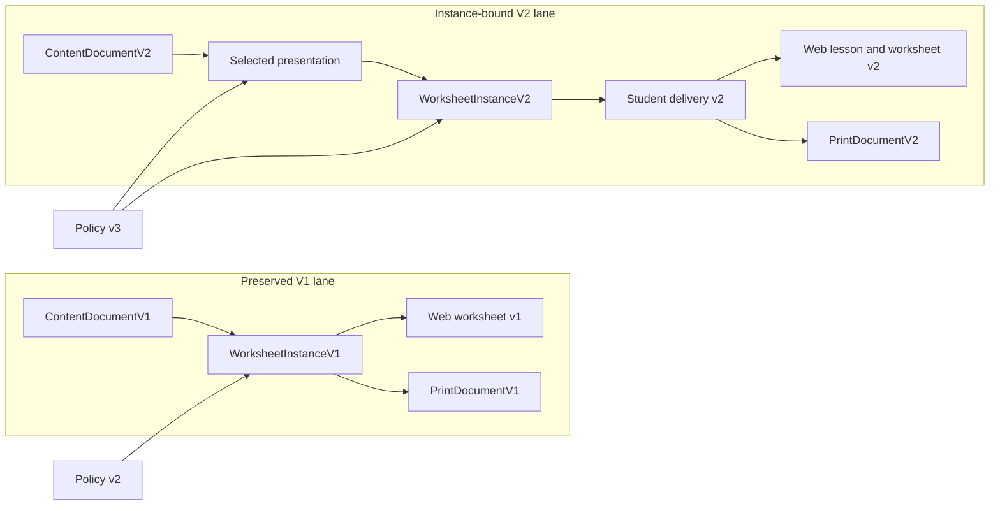
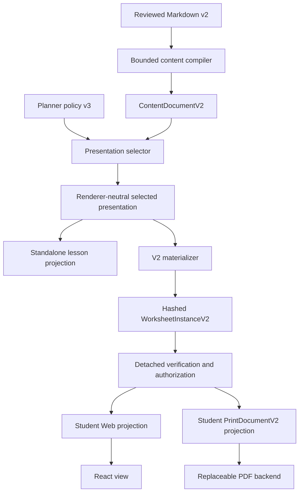
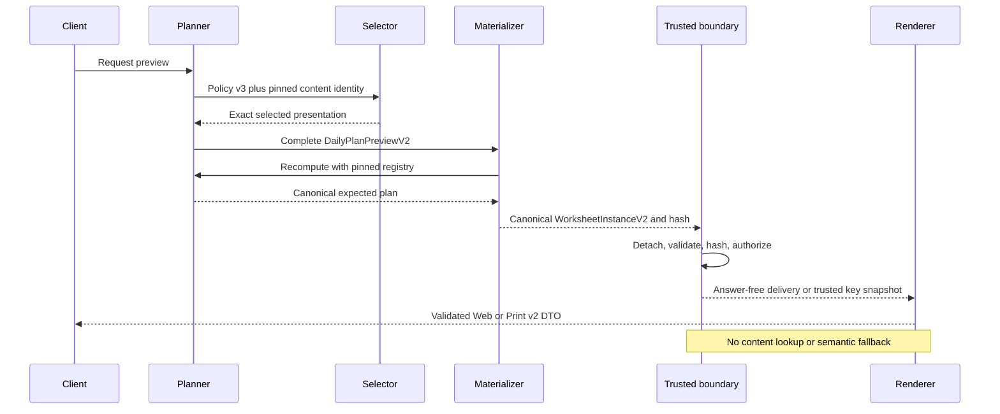

# ADR-0003: Instance-bound learning presentation

- Status: Accepted
- Date: 2026-07-19
- Implementation checkpoint: 2026-08-02
- Owners: Exercise Book maintainers

## Context

The Phase 1 worksheet instance commits generated practice, provenance, planner
identity, and content references. It does not commit the explanation or worked
example shown around that practice. The standalone lesson, Web worksheet, and
print projector can therefore use separate application-owned constants while
all claiming the same content and worksheet identity.

That gap has both product and correctness consequences:

- changing an explanation need not change the instance hash;
- Web and paper can teach different steps for the same assignment;
- a worked example can disclose a generated answer unless its complete
  semantics participate in planner exclusions and student authorization;
- resolving mutable content during rendering makes historical assignments
  dependent on current catalog state; and
- adding fields to the existing V1 contracts would reinterpret already fixed
  hashes and artifacts.

The next slice needs to make the reviewed presentation reproducible without
making React, HTML, TeX, or a PDF backend canonical.

## Decision

### 1. Add a parallel V2 execution lane

Introduce explicit V2 content, worksheet, student-delivery, Web-projection, and
PrintDocument contracts beside the existing V1 contracts. Each serialized
contract has its own schema discriminator and validator. Adapters dispatch on
that discriminator; no unversioned union guesses a version from optional
fields.

The V1 compiler, materializer, projectors, fixed vectors, semantic goldens, and
artifact verification remain executable and byte-preserving. Policy v3 selects
the V2 lane for new previews only after its registry entry is enabled. Policy
v2 remains a valid rollback path and historical V1 instances are never upgraded
or reinterpreted.

The public preview request also has an explicit V2 discriminator. The shared
endpoint dispatches request v1 only to response/policy/worksheet v1 and request
v2 only to the V2 lane; it never changes response version from ambient active
configuration. This keeps old and new wire contracts simultaneously testable.

### 2. Commit one renderer-neutral selected presentation

A pure, versioned selector resolves reviewed content into a bounded selected
presentation before worksheet canonicalization. `WorksheetInstanceV2` embeds
that exact value, so its canonical bytes and instance hash commit every selected
learner-facing byte and semantic value.

The selected presentation contains only the material needed by the assignment:

- exact content ID, revision, source hash, content hash, and compiler version;
- policy-selected lesson, worked-example, and exercise node IDs;
- ordered, bounded explanatory blocks;
- a typed fraction-addition example model with canonical operands/result and
  exact common-denominator intermediate integers;

Attribution remains in the instance's top-level attribution collection and is
derived from the same validated content identity. Validators and parity tests
require exact attribution agreement across controlled content-to-instance
materialization, standalone lesson, Web worksheet, and PrintDocument. The
standalone instance schema validates shape and internal consistency; it does
not claim to reconstruct absent author/license source data.

It is not a ContentDocument copy and does not contain React elements, DOM
attributes, HTML, CSS, TeX documents, PDF commands, or backend layout
instructions. Mathematical display and accessibility strings are derived from
typed semantics under versioned rules; renderers may change layout but may not
select, regenerate, or reinterpret the lesson.

The standalone lesson endpoint and V2 materializer must use the same selector
and presentation schema. A worksheet renderer reads the presentation embedded
in the verified instance and never looks up current content. Completion tests
compare the standalone lesson, worksheet Web, and print semantic snapshots for
equality of presentation and source identity.

### 3. Make policy v3 own selection and collision inputs

Policy v3 pins, and includes in plan/seed identity:

- the exact content ID, revision, source hash, and content hash;
- the selected lesson, worked-example, and exercise node IDs; and
- the ordered reserved canonical tuple `[left, right, result]` for the selected
  example.

The selector fails unless every pinned identity resolves exactly once. The
typed example must be mathematically self-consistent, and its canonical
`[left, right, result]` must equal the policy tuple in the same order. The
generator treats all three tuple values as excluded canonical practice answers.
Selection, tuple, or identity mismatch fails closed; the application does not
substitute a default node, constant example, or alternate problem sequence.
The dedicated V2 materializer accepts one complete `DailyPlanPreviewV2`, not a
second flattened set of assignment claims. It validates and detaches that plan,
reconstructs its request-defining inputs, reruns the pinned planner with the
final V2 registry, and canonical-compares the complete supplied and expected
plans before content hashing or generation. The comparison binds the plan ID,
seed, requested and planned budgets, item count, selection reasons, content and
node identities, ordered exclusion tuple, policy, skill graph, and evidence
version to one real planner output. Every worksheet claim is then derived from
that authorized snapshot.

The standalone instance schema remains policy-agnostic enough to validate
historical artifacts; exact current-policy provenance is enforced only at the
materialization boundary that creates new instances.

### 4. Preserve one verified snapshot through every projection

V2 follows the Phase 1.6 detached-snapshot rule. Before the first asynchronous
hash operation, the boundary validates and detaches the materialization
envelope. Integrity verification, presentation authorization, answer-key
projection, Web projection, and PrintDocument projection all consume that same
snapshot and never reread caller-owned values after an `await`.

Student delivery includes the selected presentation and answer-free practice
only. Trusted canonical-answer context remains server-only. The role-sensitive
student authorization scans the complete presentation, including structured
example and intermediate rational forms and accessible text, plus every
student-visible practice field including print fallbacks, against every
generated practice answer. Its string normalization computes a deduplicated
closure over raw and NFKC forms, form-style `+` spacing, common outer
URI-wrapper layers, percent-collapse states, and URI-decode states. When a
whole string is provably a canonical `encodeURIComponent` wrapper, all but one
common outer layer is compressed at the same round while relative percent
depth is preserved. At every remaining URI compatibility round, the current
value and its independently percent-collapsed derivative are separate decode
candidates. Neither branch subsumes the other: decoding `%2539%2F35` directly
preserves an intermediate containing `39/35`, while collapse-first decoding
can reinterpret `%39` as one encoded byte. Every resulting state remains
eligible for the next transformation, so a URI decode that exposes a fullwidth
percent sign or hexadecimal digit cannot escape a later NFKC and URI-decode
pass. Mixed compatibility forms receive at most three URI-decode rounds and
the worklist admits at most 24 value-and-round states. Exceeding either bound
rejects the delivery rather than treating a partial closure as safe. These
fixed limits keep work linear in the already validated string length. Mixed
forms such as `%25%32%46`, malformed percent suffixes, and truncated UTF-8
cannot suppress valid-byte fallback and later bounded normalization. Before a
slot answer enters that trusted context, the V2 instance validator proves by
bounded exact rational arithmetic that it equals the sum of the prompt
operands; matching scoring and solution fields are not sufficient by
themselves. The final Web and Print student DTOs are independently validated
and scanned after projection.

### 5. Keep renderers and delivery bounded

Web and Print v2 are projections of the selected presentation, not alternate
sources of instructional prose. The student and answer-key variants preserve
the same source instance hash and semantic presentation. PrintDocumentV2 stays
renderer-neutral and may be rendered by printable HTML, Browser Run, Typst, or
restricted LuaLaTeX adapters without changing the instance.

The V2 public DTOs retain explicit graph, string, node, response-byte, stream
read, and validation-depth limits. The full ContentDocument and trusted
canonical-answer context are never serialized to browser state, DOM metadata,
logs, analytics, public URLs, or student artifacts. Increasing a transport or
document limit is a reviewed contract change, not an incidental response to
presentation growth.

### 6. Verify the emitted client graph independently of source intent

Browser privacy uses three complementary gates. Production browser code may
reach only exact reviewed public leaves and their exact transitive dependencies.
The Vite build then examines final Rollup `OutputChunk.modules` provenance and
rejects client chunks containing server, Worker, generator, or other
unreviewed workspace modules. Finally, a bounded post-build canary scans every
regular emitted file for protected answer, seed, scoring, and solution-trace
tokens. Its walk rejects symbolic links and non-regular entries and fails
closed above 1,000 total entries, 20 MiB of regular-file content, or depth 16.

The canary is defense in depth, not an absence proof: minification can rename
tokens, and an equivalent answer can be represented as a decimal, percentage,
or prose. Likewise, tree-shaking can remove unsafe bytes from one build without
making the reachable source graph safe. Source reachability, emitted module
provenance, structured semantic authorization, and the raw artifact canary are
separate evidence and must not be substituted for one another.

### Implementation checkpoint

As of 2026-08-02, the strict V2 worksheet Web DTO, trusted projector,
application service, and exact V1/V2 Hono request/response dispatch are
implemented. Injected planner, materializer, and projector outputs are detached
and exact-replayed against trusted implementations. Presentation unavailability
is limited to `content-identity-mismatch`, `invalid-selection`,
`selected-node-count`, `selected-node-type`, `exercise-contract-mismatch`,
`worked-example-arithmetic-mismatch`, `excluded-answer-tuple-mismatch`, and
`presentation-invalid`; materialization unavailability is limited to
`unsupported-content-state`, `locale-mismatch`, and `generation-exhausted`.
An injected unavailable outcome must match the trusted replay's exact internal
reason kind and code. Presentation `unsafe-input`/`invalid-content`,
materialization `unsafe-input`/`invalid-assignment`/`invalid-instance`, and any
future unclassified code remain exceptions until explicitly reviewed.
Unexpected route failures emit a fixed, sanitized structured 500 report without
raw exception or request data.

The parallel print checkpoint implements schema `exercisebook.print/v2`, source
schema `exercisebook.worksheet-instance/v2`, and projector
`print-projector.v2` through separate V2 validator, canonicalizer, student
projector, and answer-key projector entrypoints. Each projection rejects unsafe
option/materialization graphs before property access, detaches the complete
instance before the first asynchronous hash, requires exact canonical bytes and
SHA-256, and preserves `sourceInstanceHash`. Student and shared answer-key
blocks are reconstructed solely from the answer-free
`StudentWorksheetDeliveryV2`; only the ordered key appendix reads the same
verified full-instance snapshot. Student and key canonical documents therefore
share presentation, problem order, attribution, and source identity but have
distinct document hashes.

The package root deliberately exports only the reviewed V2 contract,
validation, canonicalization, projection, and worksheet-verification surface.
Direct document materialization, block internals, resource-limit constants, and
the trusted-answer final authorization helper remain private. Structural V2
validation proves exact shape and internal consistency, not source authority or
student authorization. Those properties require the verified projector path,
and an external request additionally requires the application service's trusted
planner/content/materializer replay. A self-consistent hash alone is not that
authority.

Production print source may import only exact `@exercisebook/domain`,
`@exercisebook/schemas`, and
`@exercisebook/schemas/trusted-student-projection` roots plus relative package
modules. The boundary rejects generator, planner, compiler, unreviewed subpath,
and test-only imports so print projection cannot replan, regenerate, or look up
current content. The semantic `paper: "a4"` discriminator participates in the
document hash but does not establish page layout.

This remains a bounded semantic backend checkpoint, not implementation of the
complete ADR. The active React UI still uses V1. Printable V2 HTML and artifacts,
rendered A4 behavior, standalone lesson delivery, React V2 integration, and
browser/visual/accessibility gates remain incomplete. The prepared-guard
checkpoint is on `feat/prepared-answer-guard`, stacked on
`feat/v2-print-document` at
`129f35edcc7118a84f383dc16d1b8a575892e3dc` (parent draft PR #6). No child PR is
claimed here, and nothing in this checkpoint is merged or deployed.

Reviewed content hashes and all five frozen V1 worksheet/PrintDocument/HTML
identities remain unchanged. The V1 attribution schema also retains one runtime
object identity across the root, safe-leaf, presentation, and worksheet
exports. The aggregate `pnpm check` is green with TypeScript 7.0.2 and
1,315/1,315 Vitest tests across 48 files. Focused evidence is 143/143
print-package tests across 10 files, 358/358 schema tests across 5 files
(including 162/162 schema-contract tests), 75/75 equivalent/prepared-guard
tests, 67/67 source/config boundary tests plus the live scan, 37/37 final
module-provenance tests, and 24/24 artifact-scanner tests. Production build and
existing sample verification pass without identity changes. The fixed V2
worksheet instance hash remains
`934bd3949b6284bbb4061a29b3075560f9389b096ec4f913ad56788e06ac0d02`.
The student PrintDocument hash is
`51892552e00caac748d0ceb2532ed7eb1d7a1e094eef887cb0cc941fd8f80111`
at 12,077 canonical bytes with 3,987,923 bytes of headroom below the
4,000,000-byte cap; the answer-key hash is
`d5a5b226bb485ed8e3cb8a43ef05695015e2a00bb97fe6a85530c654b7db0ebd`
at 16,012 bytes with 3,983,988 bytes of headroom.

The 365-day maximum serialized V2 Web response remains 5,964/32,768 bytes
(26,804 bytes headroom). The production client records 112 modules and the raw
artifact scanner covers 328,591 bytes. These print hashes authenticate semantic
JSON only: no V2 HTML/PDF artifact, page count, clipping, text extraction,
accessibility, or rendered A4 conclusion follows from them. The patched
Cloudflare development stack pins `@cloudflare/vite-plugin@1.49.0`,
`@cloudflare/vitest-pool-workers@0.19.1`, `wrangler@4.116.0`, and resolved
`miniflare@4.20260730.0` / `sharp@0.35.2`; the 2026-08-02 `pnpm audit` run
reported no known vulnerabilities. Later advisory data may change that result.

## Invariants

- Every selected learner-facing presentation byte is committed by the V2
  instance hash.
- Content and selected node identities resolve exactly once and match policy
  v3.
- The typed example is exact, self-consistent, and equal to the ordered policy
  tuple.
- Every trusted canonical practice answer equals the exact rational sum of its
  prompt operands.
- No generated practice answer is rationally equal to example left, right, or
  result.
- Standalone lesson, worksheet Web, and print expose the same semantic
  presentation and source identity.
- Rendering never performs current-content lookup, node selection, problem
  generation, or fallback interpretation.
- Student outputs contain no practice answers, scoring rules, solution traces,
  misconceptions, seeds, or trusted projection context.
- V1 inputs continue through V1 validators/projectors and keep their historical
  canonical bytes and artifacts.

## Consequences

### Positive

- A worksheet hash now identifies the exact explanation that accompanied its
  practice.
- Web, accessible lesson, and paper parity can be tested semantically instead
  of inferred from a shared content reference.
- Content defects and presentation changes have attributable revisions and a
  deterministic rollback boundary.
- PDF backends remain replaceable because the instance stores learning
  semantics rather than layout source.
- Worked-example collision avoidance becomes an explicit planner/materializer
  contract rather than a UI constant.

### Costs and risks

- V1 and V2 code paths, schemas, fixtures, and artifact checks must coexist
  until V1 retention requirements end.
- V2 payloads and printable documents are larger; response budgets, page count,
  clipping, text extraction, and accessibility require explicit gates.
- The selector and materializer must reject duplicate or missing nodes rather
  than using convenient positional matching.
- Typed example semantics and authored prose are two related representations;
  the compiler proves the structured arithmetic and prose shape/resource
  safety, while named human curriculum review remains responsible for the
  prose/model relationship.
- New policy, content, instance, Web, and print fixed vectors are expected to
  differ from V1 and must be reviewed rather than copied.

## Security and privacy consequences

- Embedding presentation increases the student-visible surface subject to
  answer-disclosure checks. Intermediate forms such as `3/6` are compared by
  rational equality, not only string equality.
- Recognized fraction-like text is reduced to a bounded rational signature
  after the existing normalization closure. Slash and Unicode slash forms,
  spaced `over`, bounded TeX `\frac`, and bounded numerator/denominator
  object-like text are covered. Decimal, percentage, and arbitrary
  natural-language equivalents remain residual risks; exceeding the answer,
  candidate, or integer bounds rejects the delivery instead of accepting a
  partial scan. This fail-closed policy may reject an answer-equivalent
  fraction-looking URL path or prose fragment.
- Trusted server projectors prepare one opaque answer guard per authorization
  phase. Preparation validates and detaches the canonical-answer array once and
  constructs the complete and per-slot signature sets in O(N). Only
  `@exercisebook/schemas/trusted-student-projection` exports this API; browser
  source and artifact boundaries reject it. The root one-shot assertion remains
  behavior-compatible for callers without a phase.
- One prepared assertion has a combined 4,096-candidate cap across structured
  and recognized-text rationals; all assertions in the phase share an 8,192-
  candidate cap. End-to-end production Web/Print projection entrypoints have
  two fixed authorization phases, and the replay-authorized V2 service path has
  three. These fail-closed phase bounds neither replace trusted-replay-first
  ordering nor establish a request-wide deadline, memory cap, or whole-CPU
  guarantee.
- A schema-valid, unique-answer boundary fixture consumes 6 candidates in
  delivery and `12 + 10N` in the final Print phase, or `18 + 10N` across both
  direct V2 phases. At N=200 the heavier phase consumes 2,012/8,192 and the
  two-phase total is 2,018. Prepared trusted/full V2 p50 is 7.13/30.08 ms at
  N=100 and 13.48/56.63 ms at N=200. These are local Apple M5 Pro / Node 26.5.0
  reference measurements after 3 warmups and across 15 measured runs, not a CI
  latency or SLO gate; deterministic counters and tests are the regression
  evidence. Instrumented answer-guard BigInt conversions across trusted
  delivery and final Print authorization are `24N + 36`: 4,836 at N=200 versus
  the former guard-only 487,636 baseline, about 100.8x fewer. Other validation
  and canonicalization conversions are outside this structural count.
- Broad materialization has a distinct effective-envelope issue. A generated-
  style payload passes at N=178 with 548,377 canonical bytes but fails at N=179
  with 551,466 canonical bytes when complete safe-graph inspection exceeds its
  1,000,000 string-code-unit cap. This is not a guard failure. A follow-up must
  reconcile the advertised problem maximum with the materialization envelope.
- Raw Markdown, raw HTML, general TeX, executable content, arbitrary URLs, and
  the full ContentDocument remain outside the delivery boundary.
- A hash proves integrity but not safety; detached verification and final
  role-sensitive projection checks remain mandatory.
- Browser-reachable source and protected workspace barrels cannot import or
  re-export the trusted projection subpath or trusted named bindings from its
  mixed V1/V2 implementation modules. The pinned Vite/Oxc AST policy rejects
  computed module loads and every production Vite glob, confines browser
  module and asset edges, rejects backslash-normalization ambiguity, and
  inspects transitive schema re-exports. Exact review gates also lock root and
  browser-package manifests, execution scripts, production runtime
  dependencies, the complete lockfile, pnpm workspace resolution, Vite and
  Wrangler configuration, the absence of a Vite public directory, and the
  reviewed HTML tag/attribute/URL and browser CSS asset surfaces. CI validates
  the root manifest, workspace configuration, complete lockfile, and every
  current workspace package manifest with a built-in-only pre-install check. It
  runs after checkout and cache-free Node setup but before the first pnpm setup,
  cache, or CLI invocation. It rejects unknown or missing workspace manifests,
  repository-local `.npmrc`/`.pnpmfile.*` inputs, and every direct `*.gyp`
  entry in the root or a workspace package before dependency installation. The
  browser boundary also rejects every implicit PostCSS configuration filename
  and `package.json` field searched by the pinned Vite/PostCSS loader from
  `apps/web` through the workspace root. Style inspection covers the Web,
  renderer, domain, planner, and schemas browser-safe roots. Only reviewed
  plain CSS is accepted: CSS Modules, ICSS dependency forms, and Vite's other
  style-language extensions fail closed. Every executable source root also
  rejects extensionless regular files and unreviewed extensions that Vite could
  parse as JavaScript; only the pinned Vite static-asset surface, JSON, and the
  separately inspected style surface remain non-executable exceptions. The
  policy validates the lock before dynamically loading Vite/Oxc. Missing
  reviewed inputs fail closed. These are accidental-drift and review gates, not
  a substitute for branch protection against a contributor who changes the
  workflow and its tests together. Worker and print server boundaries remain
  explicit import exceptions, but their source trees are still enumerated by
  the executable-file rule.
- Answer-key projection stays an explicit trusted variant. A loaded or pending
  answer key cannot be treated as a student DTO or reused in student state.
- Source identities and public attribution may be delivered, but learner
  identity, answers, accommodations, and secrets remain absent from public
  keys, URLs, caches, and telemetry.

## Rollback

Disable policy v3 and its V2 content/registry entries for new previews, then
reactivate policy v2 and the preserved V1 lane. Do not convert an existing V2
instance to V1, regenerate its slots, remove its embedded presentation, or
overwrite any content-addressed artifact.

Historical V2 instances retain their V2 renderer and validator support. A
renderer regression is rolled back by restoring the prior V2 application or
backend revision; it is not handled by feeding V2 data into V1 code. A defective
V2 content revision is disabled for new work and replaced by a new revision.

## Alternatives considered

### Add optional presentation fields to WorksheetInstanceV1

Rejected because it changes what a V1 schema accepts and risks reinterpreting
fixed V1 hashes, projectors, and historical artifacts.

### Resolve ContentDocument nodes whenever Web or print renders

Rejected because current catalog state could change historical output, content
failure could make an already materialized worksheet unavailable, and separate
renderers could select differently.

### Keep application-owned lesson and worked-example constants

Rejected because their changes are not committed by the instance hash and
cannot provide attributable Web/print parity.

### Store Web DTOs, HTML, TeX, or PDF layout in the worksheet instance

Rejected because it makes a renderer canonical, couples learning history to a
framework/backend, and prevents independent accessible Web and print evolution.

### Embed the complete ContentDocument in every worksheet

Rejected because it expands payload, privacy-review, parsing, and authorization
surface while still requiring a deterministic rule to decide which nodes were
shown.

### Infer worked-example exclusions inside the generator or projector

Rejected because replay and answer safety would depend on hidden behavior not
present in planner provenance. Policy v3 must own the ordered tuple and the
generator must record deterministic retries.

### Repair a mismatch by redacting prose or generating a replacement problem

Rejected because render-time repair changes instructional meaning or assignment
semantics. Identity, selection, tuple, and disclosure mismatches fail closed.

## Verification

This decision is implemented only when:

- selected-presentation mutation changes the V2 instance hash;
- missing, duplicate, reordered, or identity-mismatched selected nodes fail;
- mathematical inconsistency or policy-tuple mismatch fails;
- broad deterministic seeds produce no answer colliding with the reserved
  tuple;
- standalone lesson, student Web, answer-key Web, student print, and answer-key
  print semantic snapshots agree on presentation and source identity;
- caller mutation across asynchronous verification cannot change either
  variant;
- V2 student Web/print leak and resource-bound tests pass;
- real responsive Web and A4 print accessibility/layout checks pass; and
- every V1 fixed vector and checked-in artifact remains byte-identical.

## References

- [Exercise Book roadmap](../roadmap.md)
- [Core architecture](0001-core-architecture.md)
- [Student Delivery Hardening v1](../../specs/student-delivery-hardening-v1.md)
- [Engineering guardrails](../../AGENTS.md)
