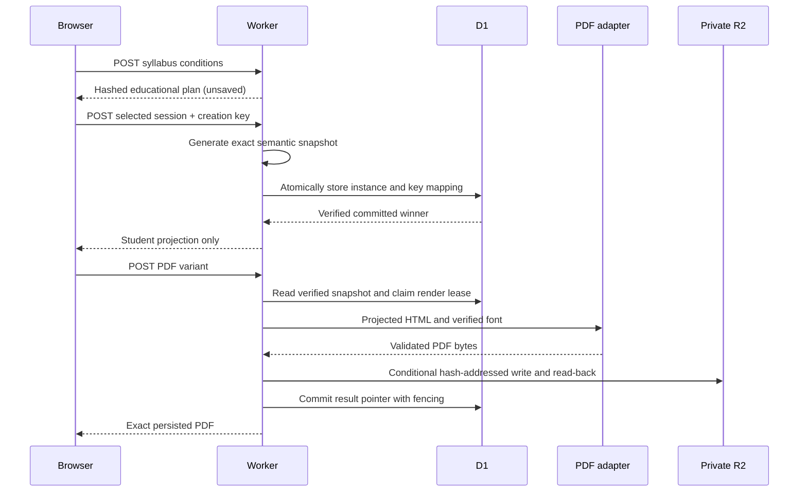

# ADR-0005: Plan a syllabus and persist generated workbooks before presentation

- Status: Accepted for the owner-authorized hosted evaluation
- Date: 2026-09-22

## Context

The owner requested deployment and a usable educational syllabus, rather than
only a fixed drill catalog. The first Japanese release offered eighteen fixed
selections. Its verified layout and mathematical explanation relations remain
useful, but repeated practice needs varied problems and an explicit learning
sequence. This decision supersedes ADR-0004's finite-only runtime scope and
pending hosting decision. It does not claim educator certification or grant a
new open-content license.

## Decision

### Learning design

`studio-syllabus-v1` is an anonymous, unsaved course plan produced by the pure
`algebra-foundation-plan@1` policy. Inputs are one of three bounded goals,
self-reported starting experience, two/four/six weeks, and ten/fifteen/twenty
minutes per study day. A week has at most five study-day slots. The six skills
cover integer arithmetic, values of linear expressions, and integer solutions
of `ax + b = c`. They do not cover the full secondary-school curriculum.

Each session records its objective, prerequisites, explanation focus, practice
conditions, reason code, time allocation, reflection, and confirmation criteria.
The schedule includes introduction/practice and delayed review/check phases.
Reviews are separated from the immediately preceding same-skill session by at
least three study-day slots. Empty slots remain available for rest or catching
up; the planner does not fill them with arbitrary extra questions. Incomplete
coverage is explicit. These are planned intervals, not observed elapsed-time
evidence. Self-report changes explanation/practice allocation and never creates
mastery. Checkpoint screens initially collapse the worked example.

The exact plan is canonicalized and hashed. It remains in page memory and may
be downloaded as JSON or printed. No account, learner profile, answers,
completion events, cookies, or Web Storage are added. Future evidence-based
adaptation requires a separate privacy and domain decision.

### Deterministic generation and identity

An explicit `POST /studio-api/workbooks` with an `Idempotency-Key` UUID requests
a generated workbook. The client retains the key on a failed request and reuses
it when reopening the same planned session in that page. A new independent
creation gets a new key. Requests without this header retain ADR-0004's fixed
sample behavior for compatibility; a failed generated request never falls back
to that sample.

The generator uses the existing versioned xoshiro RNG and HMAC-derived slot
seeds. The base seed is derived from the creation key, independently of time,
locale, or process randomness. Arithmetic, substitution, and equation models
derive prompts, exact integer answers, and typed solution steps together.
Rejection is bounded, with a deterministic finite fallback. Duplicate prompts
and the lesson's example answer are excluded from the practice set.

`exercisebook.generated-studio-workbook/v1` stores the source revision, exact
student workbook, answer key, semantic models, generator version, RNG version,
base seed, slot seeds, families, and generation attempts. SHA-256 over canonical
JSON binds the complete snapshot. The public `studio-workbook-v1` projection
remains unchanged; `saved: false` refers to absence of a learner's saved account
or history, not absence of the server's immutable content snapshot. Product
copy explains that questions/keys are retained while learner submissions are not.

Level-specific original Markdown lessons pass the same constrained compiler.
The three original sources and their fixed vectors remain unchanged; three
standard-level sources supply multiplication, negative substitution, and a
negative-coefficient equation example. Their source paths and content hashes
are included in the release inventory. The original reserved-rights evaluation
metadata remains separate from the English lesson's CC BY grant.

### Persistence and retries

D1 stores bounded (64 KiB maximum) immutable content snapshots, hashed creation
key mappings, and render-job metadata. A transaction commits the instance and
request mapping before any student response is returned. Same-key/same-payload
retries return the first committed snapshot even after deployment changes;
different payloads return 409. Losing concurrent creates do not leave unused
instances. Reads verify the stored JSON hash, semantic instance hash, and row
relations without invoking the generator.

These tables contain original public practice content and opaque request-key
hashes, not learner identities, free-form goals, submitted answers, scores, or
syllabi. Content is retained so the exact questions remain reconstructable.
Requests, responses, raw creation keys, and answer data must not be logged.

### On-demand PDF rendering

Generated PDFs require a same-origin `POST` with the selected variant and an
empty JSON object. A `GET` cannot create a generated assignment or render job.
Existing immutable sample PDFs continue to support read-only GET downloads.

The existing print projector renders the stored snapshot. A new replaceable
Cloudflare Browser Run adapter uses pinned `@cloudflare/puppeteer@1.4.0` and the
hash-verified vendored Noto font, stored privately in R2. It disables JavaScript,
denies outbound HTTP/S in browser guardrails, permits only the exact approved
inline font, checks actual fonts and layout, and bounds input, output, browser
lifetime, and concurrent work. Cloudflare manages the browser image; byte-for-
byte rerender reproducibility is not promised. The first accepted PDF bytes
and their hash are retained unchanged.

The pinned Puppeteer package includes a vulnerable Node ZIP installer dependency
that this Worker does not invoke. Until an upstream fixed version is published,
the workspace applies a narrow reviewed patch that rejects ZIP symlinks and
existing destination files. The dependency-audit command verifies its exact
bytes and eight extraction regressions before excluding the two addressed
advisories for that invocation. See the [security decision](../security-extract-zip.md)
for compatibility limits and removal conditions.

Render identity binds instance, variant, print-document hash, HTML hash, font,
and renderer policy. A D1 lease with a token and exact expiration fences stale
workers. R2 receives a conditional content-addressed write. The service reads
back and verifies the winning object before committing the result pointer by
CAS. A completed pointer is immutable. Missing/corrupt stored artifacts fail
loudly and are never silently replaced by different questions or PDFs.

Rendering is synchronous within a bounded request, with an explicit retryable
busy response. This avoids adding a queue for this small evaluation. Retrying
the same request observes the same job contract. A future queue may reuse the
claim protocol, but requires its own at-least-once delivery tests. Separate
creation/render rate limits bound resource use independently of ordinary reads.

### Transport and deployment

Syllabus JSON needs more than the shared reader's old 512-value budget. A new
optional value limit preserves 512 for existing callers and caps explicit
overrides at 4096. Only the syllabus reader opts in, retaining the 64 KiB byte
limit, depth limit, duplicate-key rejection, and cancellation behavior.

The action domain remains a stateless redirect to the canonical primary origin.
Initial verification uses a separate preview Worker. Production promotion must
record prior and new Worker versions, preserve the D1/R2 bindings, verify the
real create/grade/PDF flow, and switch the synthetic to the new syllabus contract.
No learning history is migrated. Rollback restores a complete Worker version
without deleting snapshots, rewriting artifact bytes, or changing the action
domain's safe redirect.

## Verification

Required gates include independent arithmetic and equation-equivalence checks
over broad seed ranges, frozen vectors, bounded fallback, exact-instance reads,
concurrent idempotency, transaction rollback, expired/stale claims, artifact
relation/integrity failures, student/answer separation, all syllabus conditions,
HTTP rejection before storage, real PDF text/font/layout checks, and browser
journeys including failure recovery. A readonly synthetic checks the syllabus
without generating durable content on each scheduled run.

## References

- [Browser Run Puppeteer](https://developers.cloudflare.com/browser-run/puppeteer/)
- [Browser guardrails](https://developers.cloudflare.com/browser-run/features/guardrails/)
- [Browser limits](https://developers.cloudflare.com/browser-run/limits/)
- [Syllabus scope and educational sources](../syllabus-design-notes.md)
