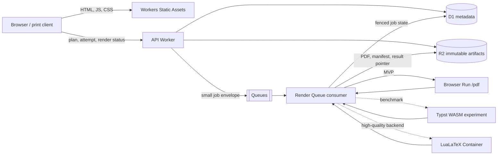
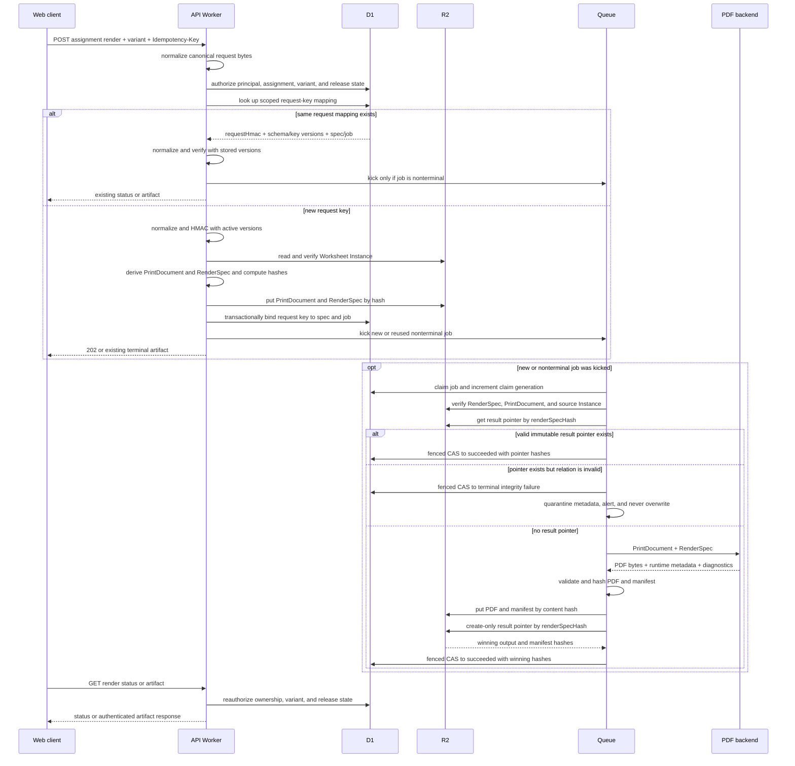

# Printing and Cloudflare architecture

Checked: 2026-07-19

Cloudflare product status, limits, and pricing change. Recheck the linked
primary sources before a production capacity or cost decision.

This document evaluates future hosted architecture. The repository's Phase-1
implementation ends at local printable A4 HTML; none of the PDF backends or
Cloudflare resources below are claimed as deployed.

## Recommendation

Exercise Book is not a “Markdown to PDF” command. It is a versioned content
system with two semantic representations and several replaceable renderers.

```text
Markdown + YAML + allowlisted directives
  -> parse, normalize, validate, review
  -> versioned Content AST
  -> goal + learner evidence + policy version + stable seed
  -> immutable Worksheet Instance AST
       -> semantic Web renderer
       -> Print IR
            -> Browser Run PDF          (hosted MVP)
            -> Typst WASM PDF           (measured experiment)
            -> LuaLaTeX Container PDF   (high-quality backend)
```

The important invariants are:

- Web and PDF render the same concrete `Worksheet Instance AST`.
- A prompt, canonical answer, scoring rule, hints, and solution steps come from
  one semantic problem model.
- Markdown, React, HTML, Typst, and TeX are not canonical curriculum formats.
- Author content cannot execute JavaScript, shell commands, arbitrary TeX, or
  network requests.
- Every worksheet and render result is attributable through the instance,
  Render Spec, and manifest: together they record the exact content, generator,
  policy, RNG, projector, renderer, template, font, and runtime identities.
- Published artifacts are immutable. A correction creates a new revision and
  does not silently rewrite a worksheet already shown to a learner.

The hosted MVP should use **Workers Static Assets + API Worker + D1 + R2 +
Queues + Browser Run `/pdf`**. Workflows, Durable Objects, Containers, and
Sandbox are added only for a demonstrated requirement.

See [content authoring](../content-authoring.md) for the author-facing syntax
and compiler contract.

## Architecture

### Cloudflare containers



Dependency direction:

```text
Cloudflare / storage / renderer adapters
  -> application ports
  -> domain model and Worksheet Instance AST
```

The domain model must not import Cloudflare, D1, R2, Browser Run, Typst, or
LuaLaTeX types. Render backends implement one port:

```ts
type RenderSpecV1 = {
  schema: "exercisebook.render-spec/v1";
  instanceHash: string;
  printDocumentHash: string;
  rendererId: string;
  rendererVersion: string;
  templateVersion: string;
  fontBundleHash: string;
  runtimeContract: string;
  environment: {
    sourceDateEpoch: number;
    timeZone: "UTC";
    metadataPolicyVersion: string;
  };
};

type PdfRenderOutput = {
  pdfBytes: Uint8Array;
  pageCount: number;
  runtimeMetadata: Record<string, string>;
  diagnostics: BoundedDiagnostic[];
};

type RenderManifestV1 = {
  schema: "exercisebook.render-manifest/v1";
  renderSpecHash: string;
  outputSha256: string;
  instanceHash: string;
  printDocumentHash: string;
  projectionVersion: string;
  variant: "student" | "answer-key" | "teacher";
  rng: string;
  generatorVersions: string[];
  printIr: string;
  rendererId: string;
  rendererVersion: string;
  templateVersion: string;
  fontBundleHash: string;
  runtimeContract: string;
  environment: RenderSpecV1["environment"];
  runtimeObserved: Record<string, string>;
  texLive?: string;
  validation: {
    pageCount: number;
    byteLength: number;
    checks: string[];
  };
};

interface PdfBackend {
  readonly backend: RendererIdentity;
  render(
    document: PrintDocumentV1,
    spec: RenderSpecV1,
  ): Promise<PdfRenderOutput>;
}
```

The API reads the canonical instance, projects and validates
`PrintDocumentV1`, computes `printDocumentHash` and the pre-render
`renderSpecHash`, and stores both canonical documents by hash before inserting
the D1 job. The Queue consumer loads and hash-verifies those exact inputs and
the source Worksheet Instance before calling the backend, then validates and
hashes the returned bytes. The backend has no storage key or credential.
`runtimeContract` is a pinned image digest for a native backend or an explicit
managed-runtime adapter epoch for Browser Run; observed runtime metadata is
recorded only after rendering.

Every value that can affect bytes or layout is fixed before enqueue: it is
either canonical data in `PrintDocumentV1`, an explicit field of
`RenderSpecV1`, or a deterministic function owned by the named renderer/template
version. Localized text and number formatting are resolved into the Print
Document. A backend must not read the wall clock, host locale/time zone, or an
ambient “latest” configuration. Post-render observed metadata is diagnostic
only and cannot influence the output it describes.

`sourceDateEpoch` is derived by a versioned rule from immutable assignment or
content-release data and is persisted in the Render Spec. It is never the
render-request wall clock. Retrying the same request mapping must select
byte-identical Print Document and Render Spec inputs.

### Render sequence



The queue message contains identifiers and hashes, not the entire worksheet or
learner data. A queued job always names an explicit render spec; a rollout must
never make an old queued job pick up an implicit `latest`.

The request key is scoped to the principal/session and assignment. D1 stores a
keyed HMAC of canonical normalized request bytes, including variant, paper,
locale, and requested accommodations that are safe for that artifact. The row
records both the normalization schema/canonicalization version and
`request_hmac_key_version`; the matching normalization code and verification
keys remain available for at least the idempotency-retention window. A deploy
or key rotation therefore cannot turn a valid replay into a false conflict.
Neither the canonical request nor the HMAC key appears in logs, URLs, public
object metadata, or Queue messages. This prevents low-entropy accommodations
from being recovered with an offline dictionary attack against a leaked D1
snapshot.

Reusing a key with different normalized request bytes returns a conflict. A
lost response followed by the same request returns the originally chosen
`renderSpecHash` and job even if active renderer configuration changed. A new
operation uses a new request key; producing a new artifact additionally
requires an explicitly changed, versioned Render Spec input or runtime epoch.

## Product boundaries

### Workers Static Assets and API Worker

Workers Static Assets deploy the static site and Worker as one versioned unit.
By default, a matching asset is served without invoking Worker code. Route
`/api/*` and authenticated PDF access through the Worker.

Use bindings rather than public REST APIs for D1, R2, and Queues. Bindings avoid
shipping API credentials and are Cloudflare’s recommended same-platform
integration.

Responsibilities:

- static HTML, JavaScript, CSS, public font subsets, and immutable public media;
- authentication and authorization;
- content catalog and worksheet APIs;
- generation orchestration and render job creation;
- private R2 proxying with `Cache-Control: private, no-store`;
- request validation, rate limiting, structured logs, and audit events.

Do not perform PDF rendering or large batch planning in the user request path.

Primary sources:

- [Workers Static Assets](https://developers.cloudflare.com/workers/static-assets/)
- [Workers best practices](https://developers.cloudflare.com/workers/best-practices/workers-best-practices/)
- [Workers limits](https://developers.cloudflare.com/workers/platform/limits/)

### D1

D1 stores transactional metadata and small queryable state:

- learner, guardian, goal, and consent metadata;
- skill graph and content revision metadata;
- daily-plan and worksheet-instance pointers;
- render job state and idempotency records;
- content, generator, policy, renderer, and template revisions;
- audit and tombstone metadata for export/delete operations.

Large ASTs, PDFs, fonts, images, and verbose logs belong in R2. D1 is not an
object store. Start with one database while the data and operational model are
small; preserve a repository port so sharding can be introduced only after
measurements show it is necessary.

Do not rely on D1 and R2 as one atomic transaction. Use an explicit job state
machine and reconciliation:

```text
pending -> rendering -> succeeded
               \-> retryable_failed -> pending
               \-> terminal_failed
```

Claiming a job atomically increments `claim_generation` and returns that fencing
token. Every lease renewal and state transition compare-and-sets the job ID,
generation, and an allowed prior state. `succeeded` is absorbing. A late worker
may finish content-addressed output, but it cannot regress or replace D1 state.

Render authorization and request idempotency use an explicit ownership link:

```text
assignment_render_request(
  id primary key,
  principal_scope,
  assignment_id,
  idempotency_key,
  request_hmac,
  request_normalization_version,
  request_hmac_key_version,
  requested_variant,
  render_spec_hash,
  render_job_id,
  unique(principal_scope, assignment_id, idempotency_key)
)
```

Creation, status, and artifact download all authorize the current principal
against this assignment, requested variant, and answer-release/teacher
entitlement state. Hashes, job IDs, and R2 keys are identifiers, not
capabilities.

If a consumer crashes after the create-only R2 result pointer but before the D1
update, a retry reads `render-results/v1/<renderSpecHash>.json`, verifies the
pointed PDF and manifest hashes, and advances D1 without rendering again. If it
crashes before that pointer is created, a retry may render again; any
unreferenced content-addressed objects are safe orphans for later collection.

Primary sources:

- [D1 documentation](https://developers.cloudflare.com/d1/)
- [D1 limits](https://developers.cloudflare.com/d1/platform/limits/)

### R2

Use separate public and private buckets or equivalently strict bindings and
policies. Accidental publication is a boundary failure, not a cache setting.

R2 stores:

- immutable `Worksheet Instance AST` objects;
- canonical Print Documents and Render Specs;
- generated PDFs and artifact manifests;
- create-only immutable render-result pointers;
- reviewed images, diagrams, fonts, and media;
- sanitized renderer diagnostics;
- source snapshots needed for license provenance.

Example keys:

```text
content/v1/sha256/<contentHash>.json
instances/v1/sha256/<instanceHash>.json
print-documents/v1/sha256/<printDocumentHash>.json
render-specs/v1/sha256/<renderSpecHash>.json
pdf/v1/sha256/<outputSha256>.pdf
render-manifests/v1/sha256/<manifestSha256>.json
render-results/v1/<renderSpecHash>.json
assets/v1/sha256/<assetHash>
```

Every `sha256` path stores the exact bytes named by that hash. The
`render-results` path is the one exception: it is a deterministic, immutable
first-writer pointer created conditionally only if absent. Its bounded payload
contains `renderSpecHash`, `outputSha256`, and `manifestSha256`. Concurrent
attempts read and accept the existing winner; they never overwrite it. The R2
adapter implements this with a conditional `put` using
`If-None-Match: *`; a failed precondition returns `null`, after which the
consumer reads and verifies the existing pointer.

All fields named `*Hash` or `*Sha256` and all `<...Hash>` path components use
exactly 64 lowercase hexadecimal characters with no `sha256:` prefix. The
schema or `/sha256/` path declares the algorithm. Reject alternate case,
prefixes, padding, and noncanonical encodings before a D1 uniqueness check or
R2 lookup.

Pointer recovery validates the complete relation, not just individual objects:

1. the pointer key suffix equals `pointer.renderSpecHash`;
2. the Render Spec bytes hash to that value;
3. the PDF and manifest bytes hash to the pointer’s output and manifest fields;
4. the manifest’s spec/output/instance/print hashes match the pointer and
   Render Spec;
5. `PrintDocument.sourceInstanceHash` equals `RenderSpec.instanceHash`,
   `manifest.printIr`, `manifest.variant`, and `manifest.projectionVersion`
   equal the Print Document schema/fields, and the referenced Worksheet
   Instance hashes correctly;
6. the manifest renderer ID/version, template version, font-bundle hash,
   runtime contract, and deterministic environment equal the Render Spec;
7. the manifest RNG and generator-version provenance equal the source
   Worksheet Instance.

Any invalid pointer or cross-paired object fails closed and is quarantined for
operator review. It is never overwritten in place.

Public artifacts use a custom domain and immutable cache headers:

```http
Cache-Control: public, max-age=31536000, immutable
```

Private learner artifacts are returned only by an authenticated Worker:

```http
Cache-Control: private, no-store
Content-Disposition: attachment; filename="exercise-book.pdf"
```

Never put a learner ID, name, accommodation, answer, or email address in an R2
key or public URL. Do not use `r2.dev` for production delivery. Never overwrite
a published content-addressed key; cache purge is not a substitute for
immutability.

For private learner data, immutability and append-only history are update and
in-service correction rules rather than indefinite-retention promises.
Authorized deletion revokes access; erases or irreversibly anonymizes the
profile, guardian/account links, goals/plans, attempts, evidence, mastery, and
private D1 mappings; then removes the private instance, Print Document, Render
Spec, PDF, manifest, result pointer, and diagnostics after the defined safety
window. Reference-aware garbage collection preserves objects still reachable
from another lawful record. Public, non-personal source/provenance records are
governed separately by the documented retention and legal-hold policy.

Primary sources:

- [R2 public buckets and custom domains](https://developers.cloudflare.com/r2/buckets/public-buckets/)
- [R2 consistency](https://developers.cloudflare.com/r2/reference/consistency/)
- [R2 and Cache](https://developers.cloudflare.com/cache/interaction-cloudflare-products/r2/)
- [R2 Workers API conditional operations](https://developers.cloudflare.com/r2/api/workers/workers-api-reference/#conditional-operations)

### Queues

PDF generation, media pre-rendering, and scheduled batch work belong in
Queues. Delivery is at least once, so duplication is an expected event.

Required controls:

- unique constraint or compare-and-set on `render_spec_hash`;
- small messages containing job IDs and hashes; resolve R2 keys server-side;
- deterministic retries;
- retryable vs terminal error classification;
- bounded retries and a dead-letter queue;
- safe DLQ replay tooling;
- reconciliation for result-pointer/D1-update split failures, plus collection
  of safe pre-pointer orphan uploads;
- create-only render-result pointer and first-writer-wins tests;
- no acknowledgement until artifact validation and durable state update finish.

A duplicate message that finds a valid immutable artifact is a successful
no-op, not an error.

Primary sources:

- [Queues delivery guarantees](https://developers.cloudflare.com/queues/reference/delivery-guarantees/)
- [Queues limits](https://developers.cloudflare.com/queues/platform/limits/)

### Workflows: not an MVP dependency

Workflows provide durable multi-step execution, automatic retries, sleeps,
external-event waits, and human approval. Those capabilities are useful only
when the product actually needs a durable process such as:

```text
import source
  -> license review
  -> content review
  -> accessibility review
  -> publish approval
```

or:

```text
large curriculum release
  -> instantiate batches
  -> render variants
  -> validate
  -> await reviewer approval
  -> publish
```

A single worksheet PDF is one idempotent Queue job. Wrapping it in a Workflow
adds state, cost, and failure modes without improving correctness. Adopt
Workflows only after at least one of these is true:

- a process must pause for an external event or human approval;
- it spans several independently retryable durable steps;
- reconstructing the state machine in D1 has become demonstrably error-prone;
- operations need Workflow lifecycle controls and observability.

Primary sources:

- [Workflows overview](https://developers.cloudflare.com/workflows/)
- [Workflows limits](https://developers.cloudflare.com/workflows/reference/limits/)

## PDF backends

### Backend comparison

| Backend | Strength | Primary risk | Role |
|---|---|---|---|
| Browser Run `/pdf` | Cloudflare-native, reuses HTML/CSS, fastest path to production | managed Chromium changes and limited advanced pagination | hosted MVP |
| Paged.js + Browser Run | better CSS Paged Media behavior | polyfill and snapshot complexity | optional HTML-print enhancement |
| Typst WASM | no Container, typed print language, potentially fast | young Worker integration, CJK font memory, Worker limits | benchmark experiment |
| native Typst in Container | simpler runtime than TeX for some documents | another backend and template ecosystem | consider after WASM evidence |
| LuaLaTeX in Container | mature math, Japanese typography, TikZ and TeX ecosystem | image size, cold starts, security, reproducibility | high-quality print backend |
| Sandbox + LuaLaTeX | per-job isolation for untrusted code | greater cost and complexity | only if raw TeX is ever accepted |

The Web renderer remains semantic HTML. Typst or TeX must never become the Web
or curriculum source of truth.

### Browser Run for the MVP

Cloudflare renamed Browser Rendering to **Browser Run** in April 2026. Its PDF
Quick Action can accept a URL or raw HTML. Exercise Book should render only
trusted HTML generated from a validated Worksheet Instance:

- never accept an arbitrary target URL from a client;
- do not pass learner cookies to a browser session;
- use a short-lived, single-purpose render token if a private render URL is
  necessary;
- load only hash-pinned fonts and assets from Exercise Book origins;
- apply a strict Content Security Policy;
- wait for explicit `document.fonts.ready` and an application render-ready
  signal, not an arbitrary sleep;
- cap pages, bytes, navigation time, and total browser time;
- record browser timing/usage headers and backend errors;
- close browser sessions in `finally`.

For a simple, stateless HTML-to-PDF operation, use the `/pdf` Quick Action.
Move to Puppeteer/Playwright browser sessions only when explicit page control
is required and justified by tests.

Managed Chromium is not a byte-for-byte reproducible engine across product
updates. Pin all inputs under our control, record the renderer contract, and
gate browser/runtime changes with semantic and visual regression tests.

Primary sources:

- [Browser Run get started](https://developers.cloudflare.com/browser-run/get-started/)
- [PDF Quick Action](https://developers.cloudflare.com/browser-run/quick-actions/pdf-endpoint/)
- [HTML/CSS to PDF](https://developers.cloudflare.com/browser-run/how-to/pdf-generation/)
- [Browser Run supported fonts](https://developers.cloudflare.com/browser-run/reference/supported-fonts/)
- [Browser Run rename and 2026 limits update](https://developers.cloudflare.com/changelog/post/2026-04-15-br-rename/)

### Typst WASM experiment

The community project
[`typst-wasm/typst-wasm`](https://github.com/typst-wasm/typst-wasm) documents a
Workers/workerd JSPI backend and PDF output. It is promising but too new to be
the default without measurements.

The experiment receives trusted `Print IR`, not author-written Typst. It must
pass:

- Japanese 1, 5, 20, and 50-page fixtures;
- Noto/Harano Aji font subsets and multiple weights;
- 100-1,000 math expressions;
- SVG and raster images;
- cold and warm compile latency;
- peak memory within the current Worker limit;
- concurrent request and failure-rate tests;
- malformed-input timeout tests;
- stable text extraction, page count, and visual snapshots.

Adopt it only if it meets an explicit p95 latency, memory, failure-rate, CJK
quality, and accessibility budget. A successful demo is not an adoption gate.

Typst’s own HTML output is experimental, so it is not the Web renderer.

Sources:

- [typst-wasm Cloudflare Workers guide](https://github.com/typst-wasm/typst-wasm/blob/main/packages/docs/src/content/docs/packages/typst-wasm/getting-started/cloudflare-workers.mdx)
- [Typst HTML status](https://typst.app/docs/reference/html/)
- [Typst PDF and tagged PDF](https://typst.app/docs/reference/pdf/)

### LuaLaTeX in Containers or Sandbox

A normal Worker cannot launch a native TeX process, and a full TeX Live/CJK
toolchain is a poor fit for the Worker memory and filesystem model. Cloudflare
Containers and Sandbox reached GA on 2026-04-13 and provide a Linux execution
environment for this workload.

Use:

- **Container** for trusted TeX emitted by an Exercise Book renderer from
  validated Print IR;
- **Sandbox**, one isolated environment per job, only if the product later
  accepts untrusted raw TeX or arbitrary code;
- neither for the MVP while Browser Run meets quality requirements.

Raw author TeX is not an MVP feature. Avoiding it is stronger than trying to
sanitize the TeX language.

Compile flow:

```text
Queue job
  -> Worker verifies D1 job, RenderSpec, PrintDocument, and source WorksheetInstance
  -> renderer converts trusted Print IR to escaped LuaLaTeX
  -> Container compiles in an empty per-job directory
  -> Worker validates and hashes the returned PDF and manifest
  -> Worker stores PDF + manifest by content hash
  -> Worker conditionally creates the render-result winner pointer
  -> Worker compare-and-sets D1 job to the winning hashes
```

The Worker owns D1/R2 bindings. The Container receives neither long-lived R2
credentials nor unrelated learner data.

Hardening baseline:

- run as a non-root user;
- pin the image by digest, TeX Live snapshot, packages, templates, and fonts;
- no runtime package installation;
- deny network by default;
- read-only toolchain and a fresh writable job directory;
- `lualatex --no-shell-escape --interaction=nonstopmode --halt-on-error`;
- restrictive `openin_any`, `openout_any`, and `TEXMFOUTPUT`;
- no `minted`, `write18`, arbitrary `\input`, URL, or filesystem path;
- resolve only reviewed asset IDs before rendering;
- cap wall time, CPU, memory, processes, reruns, output bytes, and page count;
- sanitize logs and delete all auxiliary files;
- validate PDF structure, fonts, glyph coverage, page count, and extracted text.

`--no-shell-escape` is defense in depth. VM isolation, no credentials, network
policy, and resource limits are the security boundary.

Sources:

- [Workers Node.js compatibility](https://developers.cloudflare.com/workers/runtime-apis/nodejs/)
- [Containers and Sandbox GA](https://developers.cloudflare.com/changelog/post/2026-04-13-containers-sandbox-ga/)
- [Containers architecture and lifecycle](https://developers.cloudflare.com/containers/platform-details/architecture/)
- [Container outbound traffic controls](https://developers.cloudflare.com/containers/platform-details/outbound-traffic/)
- [Sandbox security](https://developers.cloudflare.com/sandbox/concepts/security/)
- [LuaTeX-ja](https://ctan.org/pkg/luatexja)

## Deterministic worksheet generation

### Stable seeds

Do not use `learnerId + date` directly as a seed. It is predictable and can
collide across contexts.

```text
baseSeed =
  HMAC-SHA256(
    key = seedSecrets[seedSecretVersion],
    data = UTF8(canonicalJson([
      "exercisebook/base-seed/v1",
      learnerId,
      localStudyDate,
      planId,
      assignmentAttempt
    ]))
  )

problemSeed =
  HMAC-SHA256(
    key = hexDecode(baseSeed), // exactly 32 binary bytes
    data = UTF8(canonicalJson([
      "exercisebook/slot-seed/v1",
      generatorId,
      generatorVersion,
      stableSlotDerivationId
    ]))
  )
```

The tuple schema fixes each field type, date/identifier representation, Unicode
handling, UTF-8 encoding, and RFC 8785 canonical JSON. Context labels provide
domain separation; no delimiter-based string concatenation is allowed. Phase 1
has checked-in fixed slot-seed vectors for the exact encoding/HMAC contract,
including delimiter-like and non-ASCII tuple values. Any future base-seed
contract must add its own fixed vectors before its version is frozen.

Stable slot IDs prevent insertion of one problem from changing every later
problem. Record the RNG algorithm and version, such as `xoshiro128ss-v1`.
Persist `seedSecretVersion`, never the secret key itself. A stored `baseSeed`
is the HMAC output used for replay and remains inside the private instance
boundary. The Phase-1 materializer receives `seedSecretVersion` explicitly
from its caller and never infers or defaults it.
Never depend on `Math.random()`, current time, host locale, floating object
iteration order, or unspecified runtime behavior.

Generator constraints:

- construct valid values directly when possible;
- bound rejection sampling;
- deduplicate with a generator-defined semantic signature; the Phase-1
  fraction generator sorts canonical operands so commuted prompts collide;
- retry duplicates deterministically with a stable derivation ID and record the
  accepted `generationAttempt`;
- use a deterministic fallback or typed terminal failure;
- derive prompt, answer, hints, solution, and distractors from one exact model;
- store a fixed test vector for every generator version;
- test thousands of seeds for validity, distribution, duplication, and time.

### Artifact identity and manifest

```text
printDocumentHash = SHA-256(UTF8(canonicalJson(PrintDocumentV1)))
renderSpecHash = SHA-256(UTF8(canonicalJson(RenderSpecV1)))
outputSha256 = SHA-256(pdfBytes)
manifestSha256 = SHA-256(UTF8(canonicalJson(RenderManifestV1)))
```

`renderSpecHash` is known before rendering and is the render-job deduplication
and Queue retry identity.
It includes `instanceHash`, `printDocumentHash`, renderer and template
versions, the font bundle, `runtimeContract`, and the deterministic render
environment. `outputSha256` is known only after rendering and is the PDF content
address. `manifestSha256` identifies the exact immutable manifest bytes,
including observed runtime metadata. R2 stores all content-addressed documents
separately, then conditionally creates
`render-results/v1/<renderSpecHash>.json` as the immutable first-writer mapping
to the winning output and manifest hashes.

Browser Run is a managed runtime and cannot be pinned to a Container image
digest. Its `runtimeContract` therefore identifies the Exercise Book adapter,
compatibility date, and a deliberately versioned runtime epoch. Record any
platform/runtime metadata returned by Cloudflare as observed metadata. If a
managed-runtime change should create a new artifact, bump that contract rather
than overwriting the first successful mapping for an existing
`renderSpecHash`.

Example manifest:

```json
{
  "schema": "exercisebook.render-manifest/v1",
  "renderSpecHash": "aaaaaaaaaaaaaaaaaaaaaaaaaaaaaaaaaaaaaaaaaaaaaaaaaaaaaaaaaaaaaaaa",
  "outputSha256": "bbbbbbbbbbbbbbbbbbbbbbbbbbbbbbbbbbbbbbbbbbbbbbbbbbbbbbbbbbbbbbbb",
  "instanceHash": "cccccccccccccccccccccccccccccccccccccccccccccccccccccccccccccccc",
  "printDocumentHash": "dddddddddddddddddddddddddddddddddddddddddddddddddddddddddddddddd",
  "projectionVersion": "print-projector@1",
  "variant": "student",
  "rng": "xoshiro128ss-v1",
  "generatorVersions": ["fractions.add@3"],
  "printIr": "exercisebook.print/v1",
  "rendererId": "lualatex",
  "rendererVersion": "2",
  "templateVersion": "worksheet-ja@5",
  "fontBundleHash": "eeeeeeeeeeeeeeeeeeeeeeeeeeeeeeeeeeeeeeeeeeeeeeeeeeeeeeeeeeeeeeee",
  "runtimeContract": "lualatex-container@sha256:1111111111111111111111111111111111111111111111111111111111111111",
  "environment": {
    "sourceDateEpoch": 1784390400,
    "timeZone": "UTC",
    "metadataPolicyVersion": "pdf-metadata@1"
  },
  "runtimeObserved": {
    "engine": "LuaHBTeX 1.x"
  },
  "texLive": "2026-pinned-snapshot",
  "validation": {
    "pageCount": 4,
    "byteLength": 184320,
    "checks": ["pdf-structure", "fonts-embedded", "text-extraction"]
  }
}
```

Example first-writer result pointer:

```json
{
  "schema": "exercisebook.render-result/v1",
  "renderSpecHash": "aaaaaaaaaaaaaaaaaaaaaaaaaaaaaaaaaaaaaaaaaaaaaaaaaaaaaaaaaaaaaaaa",
  "outputSha256": "bbbbbbbbbbbbbbbbbbbbbbbbbbbbbbbbbbbbbbbbbbbbbbbbbbbbbbbbbbbbbbbb",
  "manifestSha256": "ffffffffffffffffffffffffffffffffffffffffffffffffffffffffffffffff"
}
```

For native renderers, set and record at least `SOURCE_DATE_EPOCH`, timezone,
locale, engine/package snapshot, fonts, templates, PDF metadata, and number
formatting. A PDF byte hash is useful but not sufficient evidence of
correctness.

## Web, print, Japanese, math, and accessibility

Web output should use semantic HTML with headings, lists, tables, labels,
MathML/plain-language math fallbacks, keyboard operation, captions, and long
descriptions. PDF is an alternate representation; the semantic Web page remains
the accessibility fallback when PDF tagging is incomplete.

Print requirements:

- A4 first; B5 after a measured user requirement;
- self-hosted, hash-pinned Japanese font files or subsets;
- Japanese kinsoku, ruby, mixed Latin, and vertical-space fixtures;
- exact math representation, not screenshots;
- explicit student, answer-key, and teacher variants;
- no answers in hidden text, metadata, alt text, or tagged structure of the
  student variant;
- attribution generated from the same license records as the Web page.

Every interactive node has:

```ts
type InteractiveContract = {
  web: InteractiveComponent;
  printFallback: StaticFigureOrExercise;
  assessmentFallback?: ExerciseNode;
  alt: string;
  transcript?: ContentNode[];
};
```

Missing `printFallback`, keyboard support, or accessible description is a
publish error, not a runtime warning.

## Security threat boundaries

Treat every representation as untrusted at its own boundary. “It came from
Markdown” does not make generated HTML, SVG, TeX, or URLs safe.

| Boundary | Failure | Control |
|---|---|---|
| YAML/Markdown parser | aliases, depth, huge input, raw HTML | size/depth/alias limits; raw HTML off |
| directives | code execution or unknown behavior | schema and explicit allowlist |
| links/assets | SSRF, tracking, path traversal | reviewed asset IDs; URL policy; no file paths |
| HTML | XSS or answer leakage | semantic renderer; sanitizer; CSP; variant tests |
| SVG/image | scripts, external loads, decompression bombs | sanitize/rasterize; byte/pixel limits |
| Browser Run | arbitrary navigation or credential leak | no client URL; no cookies; origin allowlist |
| Typst/TeX | filesystem, shell, network, resource exhaustion | generated source only; isolation and limits |
| R2/cache | private artifact exposure | separate private boundary; authenticated Worker |
| Queue | replay and duplicate effects | `renderSpecHash` idempotency, create-only result pointer, versioned jobs |
| logs | child PII or answers | structured allowlist; redaction; bounded diagnostics |

The renderer never fetches an arbitrary remote image during a job. Importers
fetch assets in a separate reviewed pipeline, verify media type/size/hash, and
store an immutable internal asset.

## Test gates

### Content and generation

- schema and unknown-directive failures;
- raw HTML, JavaScript, arbitrary URL/path, and missing-license rejection;
- fixed seed vectors and same-input byte-equivalent instance JSON;
- wide seed property tests and bounded generation time;
- canonical answer equals the last solution step;
- no ambiguous, duplicate, impossible, or answer-leaking item;
- interactive nodes include print and accessibility fallbacks.

### Web/PDF parity

- same instance ID, slot order, prompt semantics, and canonical answer;
- answers appear only in permitted variants;
- same attribution set;
- `pdftotext` semantic comparison;
- page count, document size, and render-time budgets;
- `pdffonts`/glyph coverage checks;
- Poppler raster snapshots for representative fixtures;
- manual review for Japanese, math, tables, figures, long explanations, and
  page breaks.

### Operations

- duplicate and out-of-order Queue delivery;
- crash after PDF/manifest upload but before the result pointer;
- crash after result-pointer creation but before D1 state update;
- D1 transient failure and R2 missing object;
- Browser Run quota/rate-limit and timeout;
- missing font or asset;
- Container cold start and compile timeout;
- malformed Markdown, YAML, SVG, image, Typst, and generated TeX fuzz cases;
- DLQ replay and reconciliation.

## Release and rollback gates

Renderer releases are canaryable and reversible because artifacts are
immutable and each job names a backend/version.

Release process:

1. Compile canonical fixtures with the proposed renderer.
2. Run semantic extraction, font/glyph, size, page-count, and visual snapshot
   tests.
3. Shadow-render a sample of production-safe instances without serving the
   result.
4. Canary by locale/template cohort behind a server-side feature flag.
5. Compare success rate, p50/p95 duration, browser/container usage, page-count
   drift, and manual visual review.
6. Promote the explicit renderer version; never move an untracked `latest`.

Rollback:

- switch new jobs to the prior renderer/template version;
- leave queued jobs and client request mappings bound to their immutable Render
  Spec;
- an explicit client, operator, or versioned system fallback uses a new request
  key and mapping, may record `supersedes_render_request_id`, and never silently
  rebinds the original operation;
- continue serving prior immutable artifacts;
- do not overwrite or delete a bad cached object as the primary recovery;
- create a corrected instance/revision if content semantics were wrong;
- retain diagnostics without learner PII and write a regression fixture.

Kill switches exist independently for:

- new worksheet planning;
- each PDF backend;
- each template/locale cohort;
- scheduled batches;
- publication of newly imported content.

## Adoption plan

1. Build the Content AST, Worksheet Instance AST, deterministic generator, and
   semantic Web renderer locally.
2. Add Print IR and a local reference renderer; prove student/answer-key parity.
3. Deploy Workers Static Assets, API Worker, D1, private/public R2, and Queues.
4. Launch hosted PDFs through Browser Run `/pdf`.
5. Measure Browser Run latency, usage, failure rate, and layout defects.
6. Benchmark Typst WASM against written gates.
7. Add LuaLaTeX in a pinned Container only if its print-quality benefit
   justifies operating it.
8. Introduce Workflows only for real multi-step durable or approval processes.

This sequence provides a simple hosted MVP without closing the path to
high-quality typesetting or allowing a print backend to own the curriculum.
