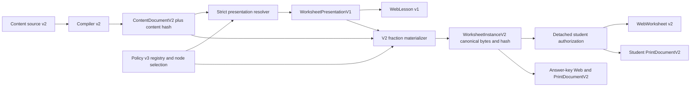
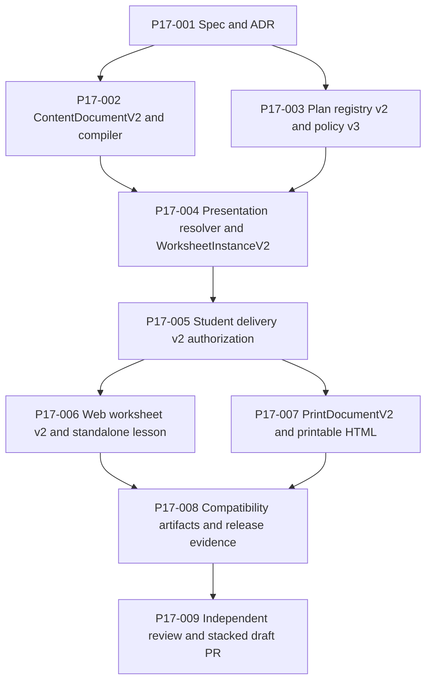

# Content-derived, instance-bound presentation v1

Status: implementation specification
Branch: `feat/content-derived-presentation`
Base: `feat/student-delivery-hardening`
Updated: 2026-07-19

## 1. Purpose

Phase 1.7 removes application-owned lesson and worked-example constants from
the active fraction-addition path. One reviewed content revision must define
the explanation, the exact worked-example mathematics, and the selected
exercise. A deterministic resolver copies that selected presentation into a
new concrete worksheet instance before hashing. The standalone lesson,
student and answer-key Web worksheets, and student and answer-key printable
documents then render that same semantic snapshot.

This is a reviewed-content correctness slice. It is not a generic content
management system, a live AI-generation feature, a public catalog release, or
a persistence/deployment slice.

## 2. User and contributor jobs

### Anonymous learner

When beginning an unfamiliar fraction-addition set, a learner needs a concise
explanation and one correct worked example before attempting the generated
problems. Moving between the lesson, worksheet, answer key, and paper must not
require reconciling different instructions or examples.

### Curriculum author and reviewer

An author edits one constrained source rather than separately changing React,
Worker, planner, and print constants. A reviewer can inspect the exact
mathematical model, learner-visible prose, selected node IDs, content identity,
and fixed artifacts before the revision is enabled.

### Operator

An operator can disable policy/content v3 for new previews and return to the
historical v1 path without rewriting, reinterpreting, or overwriting any old
content, worksheet, Web, or print artifact.

## 3. Current evidence

The current `ContentDocumentV1` worked-example node contains only `id`, `title`,
and prose children. The Web projector owns a separate `REVIEWED_WORKED_EXAMPLE`
constant, the standalone lesson owns separate React copy, and the planner owns
the ordered `[1/2, 1/3, 5/6]` collision tuple. `WorksheetInstanceV1` does not
contain a presentation snapshot. `PrintDocumentV1` can represent a
worked-example block, but the current production projector emits only title,
summary, problem, fallback, working-space, and answer-key blocks.

Those boundaries made Phase 1 and Phase 1.5 possible, but they permit content,
policy, Web, lesson, and print meaning to drift independently. Phase 1.7 makes
one selected, exact presentation value authoritative.

## 4. Scope

### Included

- one new English content revision for
  `math.fractions.add-unlike-denominators`;
- `ContentDocumentV2` and compiler v2, alongside unchanged v1 contracts;
- one explicitly identified explanation node;
- one typed `fraction-addition` worked-example model with exact rationals;
- one explicitly identified `fractions.add@1` exercise node;
- `day-one-fraction-preview@3`, with complete content identity, node selection,
  and the ordered reserved tuple as versioned inputs;
- `DailyPlanPreviewRequestV2`, internal plan v2, registry v2, and response v2;
- `WorksheetPresentationV1` embedded in `WorksheetInstanceV2`;
- detached, role-sensitive `StudentWorksheetDeliveryV2` authorization;
- Web worksheet v2 and one student-safe lesson DTO;
- `PrintDocumentV2` and printable A4 HTML;
- v2 fixed samples plus byte-for-byte preservation of every v1 vector and
  artifact;
- strict transport budgets, accessibility, privacy, parity, print-layout,
  production-build, and browser-smoke verification.

### Explicitly excluded

- live LLM generation, live AI fallback, or AI authority over published prose;
- arbitrary worked-example models or a generic expression language;
- a general Markdown, MDX, HTML, Typst, or TeX renderer;
- arbitrary tables, lists, figures, links, media, or lesson layouts;
- a content editor, content search, public catalog, or trusted release manifest;
- other goals, subjects, grades, locales, or generator revisions;
- answer submission, scoring UI, hints UI, retries, feedback, attempts,
  evidence, or mastery;
- accounts, cookies, browser storage, D1, R2, Queues, Workflows, or durable
  assignments;
- endpoint abuse controls and the complete production header policy;
- Browser Run, Typst, LuaLaTeX, hosted PDF, DNS, `learning.new`, deployment, or
  production telemetry;
- final project/content license decisions;
- reconciliation of source solution-step string bounds with the combined
  answer-key Web DTO bound unless this slice changes that contract directly.

## 5. Version and identifier registry

The following identifiers are frozen for this slice.

| Concern | Identifier |
| --- | --- |
| author source | `exercisebook.content-source/v2` |
| content AST | `exercisebook.content-ast/v2` |
| content compiler | `exercisebook-content-compiler/2` |
| plan preview request | `exercisebook.daily-plan-preview-request/v2` |
| internal preview plan | `exercisebook.daily-plan-preview/v2` |
| preview registry | `exercisebook.daily-plan-preview-registry/v2` |
| public preview response | `exercisebook.daily-plan-preview-response/v2` |
| planner policy | `day-one-fraction-preview@3` |
| skill graph | `phase-1-math@1` |
| evidence snapshot | `none@1` |
| sequence-seed domain | `exercisebook/public-plan-preview-seed/v2` |
| request-identity domain | `exercisebook/daily-plan-preview-request-identity/v2` |
| public seed version | `public-preview-v2` |
| content | `math.fractions.add-unlike-denominators@2` |
| generator | `fractions.add@1` |
| presentation | `exercisebook.worksheet-presentation/v1` |
| worksheet instance | `exercisebook.worksheet-instance/v2` |
| student delivery | `exercisebook.worksheet-delivery/v2` |
| Web worksheet | `web-worksheet.v2` |
| Web lesson | `web-lesson.v1` |
| PrintDocument | `exercisebook.print/v2` |
| print projector | `print-projector.v2` |

The selected node IDs are also fixed:

| Role | Node ID |
| --- | --- |
| lesson explanation | `lesson-explanation-01` |
| worked example | `worked-example-01` |
| generated exercise | `practice-01` |

The v2 source and compiled hashes are recorded only after compiler v2 and the
reviewed revision-2 source are complete. Policy v3 must remain disabled until
those exact hashes are fixed in code and in the execution ledger. A placeholder,
ambient `latest`, revision-only lookup, or runtime discovery is not permitted.

## 6. Compatibility rule

Phase 1.7 uses parallel versioned contracts. It must not broaden or reinterpret
the strict meaning of:

- `ContentDocumentV1` or `exercisebook-content-compiler/1`;
- `DailyPlanPreviewV1`, its registry, seed domains, or policy v2;
- `WorksheetInstanceV1` or `StudentWorksheetDeliveryV1`;
- `web-worksheet.v1`;
- `PrintDocumentV1` or `print-projector.v1`;
- the revision-1 source, compiled artifact, generator input, fixed samples, or
  artifact manifests.

Old readers remain capable of validating old values. New values use new schema
identifiers. Shared implementation helpers may be factored internally only when
v1 byte and validation fixtures prove that behavior is unchanged.

Adding optional v2 semantics to a v1 strict schema is prohibited: an older v1
reader would reject a value claiming the same schema identity.

## 7. Bounded authoring contract

### 7.1 Files

The existing files remain immutable inputs:

- `content/en/math/fractions/add-unlike-denominators.md`;
- `content/compiled/math.fractions.add-unlike-denominators.v1.json`.

The new files are additive:

- `content/en/math/fractions/add-unlike-denominators.v2.md`;
- `content/compiled/math.fractions.add-unlike-denominators.v2.json`.

The normal content check compiles and checks both artifacts. Generation never
overwrites v1 with v2 bytes.

### 7.2 Canonical directive syntax

Compiler v2 retains the Phase-1 canonical directive-header rules:

- exact `:::` container fence;
- the allowlisted ASCII directive name immediately after the fence;
- all attributes on the opening line;
- whitespace-separated ASCII `key="value"` attributes;
- no shorthand IDs/classes, labels, valueless fields, alternate quoting,
  duplicate attributes, or extra attributes;
- a closing `:::` fence;
- paragraph-only bodies for the two presentation directives.

The selected authoring form is:

```markdown
:::explanation{id="lesson-explanation-01" title="The three moves"}
Find a denominator both fractions can use.

Rename each fraction without changing its value.

Add the numerators and keep the shared denominator.
:::

:::worked-example{id="worked-example-01" title="One half plus one third" model="fraction-addition" left="1/2" right="1/3" result="5/6"}
Find the least common denominator.

Rewrite both addends as equivalent fractions.

Add the numerators and reduce if needed.
:::

:::exercise{id="practice-01" generator="fractions.add" version="1" count="8" difficulty="2" instruction="Add each pair of fractions. Give every answer in lowest terms."}
:::
```

`explanation` accepts exactly `id` and `title`.

The v2 `worked-example` accepts exactly `id`, `title`, `model`, `left`, `right`,
and `result`. `model` must equal `fraction-addition`.

The selected explanation and worked-example body each contain 1 through 8
non-empty paragraphs. For presentation v1, each paragraph contains plain text
only. Inline math, emphasis, strong text, links, images, directives, HTML,
code, lists, tables, block quotes, and display math in either selected body are
compile errors. The concrete example equation is represented by the typed
model, not by reparsing author prose.

This restriction is intentionally narrower than the long-term content format.
It guarantees that Web and print do not silently drop or reinterpret selected
content while this first presentation contract is proved.

### 7.3 Rational attribute grammar

`left`, `right`, and `result` use this complete grammar:

```text
^-?(?:0|[1-9][0-9]*)/(?:[1-9][0-9]*)$
```

Each numerator and denominator contains at most 128 decimal digits, the
denominator is positive, and the rational is already reduced. Leading plus
signs, leading zeroes, whitespace, decimal points, mixed numbers, zero or
negative denominators, and unreduced values fail compilation. Parsing uses
bounded exact integers; it never uses JavaScript `number` or floating point.

`result` is required so a reviewer can see the author's asserted result. The
compiler independently computes `addRationals(left, right)` and requires exact
canonical equality with `result`.

## 8. ContentDocumentV2

`ContentDocumentV2` retains the bounded plain-data, source normalization,
license, author, locale, skill, generator-registry, safe-math, unique-ID, and
draft-only rules of v1. Its schema and compiler-version literals are v2.

The new content nodes are structurally equivalent to:

```ts
type ExplanationNodeV1 = Readonly<{
  type: "explanation";
  id: string;
  title: string;
  paragraphs: readonly string[];
}>;

type FractionAdditionWorkedExampleModelV1 = Readonly<{
  type: "fraction-addition";
  left: RationalJson;
  right: RationalJson;
  result: RationalJson;
  commonDenominator: CanonicalPositiveIntegerString;
  leftScaledNumerator: CanonicalIntegerString;
  rightScaledNumerator: CanonicalIntegerString;
  unreducedSumNumerator: CanonicalIntegerString;
}>;

type WorkedExampleNodeV2 = Readonly<{
  type: "worked-example";
  id: string;
  title: string;
  model: FractionAdditionWorkedExampleModelV1;
  steps: readonly string[];
}>;
```

Compiler v2 normalizes each selected source paragraph by joining its plain-text
children, replacing each Unicode whitespace run with one ASCII space, and
trimming the result. An empty normalized paragraph fails. It stores those
canonical strings directly in the V2 AST as `paragraphs` on an explanation and
`steps` on a worked example. The resolver validates and copies those strings;
it does not normalize or otherwise reinterpret them a second time.

Tests freeze this single-owner rule for CRLF input, tabs, non-breaking and other
Unicode whitespace, multiple text children, leading/trailing whitespace, and
empty-after-normalization paragraphs.

The compiler derives every intermediate integer from `left` and `right` with
bounded exact integer arithmetic; authors do not supply duplicate intermediate
attributes. The runtime validator independently proves that the common
denominator is the least common multiple, both scaled numerators preserve the
operand values, the unreduced numerator is their sum, and reducing that pair
equals `result`. Structural JSON Schema records these relationships as runtime
invariants because ordinary JSON Schema cannot express them.

The compiler proves the structured arithmetic and the shape/resource safety of
the prose. It cannot prove that arbitrary natural-language prose is
pedagogically or mathematically faithful to the model. Named human curriculum
review remains responsible for that relationship; the exact reviewed prose is
then hashed and rendered without application-owned replacement copy.

## 9. Policy v3 and planner contracts

### 9.1 Request and wire-version dispatch

The V2 lane accepts the same learner inputs as V1 under the new discriminator
`exercisebook.daily-plan-preview-request/v2`. The `/api/plans/preview` endpoint
dispatches strictly by that request discriminator: request v1 produces only
response v1 through the preserved policy-v2 lane, while request v2 produces
only response v2 through policy v3. Unknown schema values fail request
validation. The active `/new` client sends request v2 after the Worker and
browser bundle are shipped together, while request v1 remains executable for
compatibility tests and rollback.

No request version is silently upgraded based on an ambient active policy, and
no request version receives the other response schema.

### 9.2 Registry input

The v2 registry pins an enabled policy, skill graph, content identity, generator,
reviewed item count, and presentation selection. The content entry contains:

```ts
type PreviewContentRegistryV2 = Readonly<{
  id: "math.fractions.add-unlike-denominators";
  revision: 2;
  sourceHash: Sha256Hex;
  contentHash: Sha256Hex;
  compilerVersion: "exercisebook-content-compiler/2";
  reviewedItemCount: 8;
  enabled: boolean;
}>;
```

The selection is:

```ts
type FractionPresentationSelectionV1 = Readonly<{
  explanationNodeId: "lesson-explanation-01";
  workedExampleNodeId: "worked-example-01";
  exerciseNodeId: "practice-01";
  excludedCanonicalAnswers: readonly [
    Readonly<{ numerator: "1"; denominator: "2" }>,
    Readonly<{ numerator: "1"; denominator: "3" }>,
    Readonly<{ numerator: "5"; denominator: "6" }>,
  ];
}>;
```

The tuple is ordered `[left, right, result]`. It is not a set, is not sorted,
and cannot contain an implicit extra or missing value.

### 9.3 Internal plan and result

`DailyPlanPreviewV2` retains the request, budget, evidence, reason, and stable-
prefix semantics of v1. Its single activity additionally carries the complete
content identity and `FractionPresentationSelectionV1`. The active policy is
exactly `day-one-fraction-preview@3`.

The budget map remains:

| Requested minutes | Item count | Planned minutes |
| ---: | ---: | ---: |
| 8 | 4 | 8 |
| 12 | 6 | 12 |
| 20 | 8 | 16 |

The sequence seed and request identity include policy v3, skill graph, evidence,
complete content identity, selected node IDs, ordered tuple, and generator
version. The sequence seed still omits the requested budget/item count so
shorter sets remain prefixes. The request identity includes the complete
validated request so different budgets retain different preview IDs.

No active v3 code reads a mutable global `latest`, discovers the content hash
at request time, selects a caller-provided node, or accepts a caller-provided
seed.

`DailyPlanPreviewResultV2` is exactly one of:

```ts
type DailyPlanPreviewResultV2 =
  | Readonly<{ status: "ready"; plan: DailyPlanPreviewV2 }>
  | Readonly<{ status: "unavailable"; code: "goal-unavailable" }>;
```

A disabled or mismatched registry policy, graph, content identity, reviewed
item count, or generator returns the sanitized planner result
`goal-unavailable` before content resolution or generation. The HTTP adapter
maps that result to the existing sanitized `503` body
`{ code: "preview_unavailable", message: "This preview is temporarily unavailable." }`.

After the registry has matched, missing/duplicate/wrong-type selected nodes,
content-document/hash disagreement, arithmetic inconsistency, tuple mismatch,
or materialization inconsistency is a typed trusted
`PresentationResolutionError` or materialization error. Those indicate broken
reviewed configuration or code, are never exposed verbatim, and the HTTP
adapter maps them to the same sanitized `503 preview_unavailable` response.
Malformed public request data remains the existing sanitized `4xx` path. No
error response echoes content, policy, request bodies, hashes, or diagnostics.

## 10. WorksheetPresentationV1

The resolver accepts one detached validated `ContentDocumentV2`, its computed
canonical content hash, and the complete policy selection. It returns:

```ts
type WorksheetPresentationV1 = Readonly<{
  schema: "exercisebook.worksheet-presentation/v1";
  content: Readonly<{
    id: "math.fractions.add-unlike-denominators";
    revision: 2;
    sourceHash: Sha256Hex;
    contentHash: Sha256Hex;
    compilerVersion: "exercisebook-content-compiler/2";
  }>;
  lesson: Readonly<{
    nodeId: "lesson-explanation-01";
    title: string;
    paragraphs: readonly string[];
  }>;
  workedExample: Readonly<{
    nodeId: "worked-example-01";
    title: string;
    model: FractionAdditionWorkedExampleModelV1;
    steps: readonly string[];
  }>;
  exercise: Readonly<{
    nodeId: "practice-01";
    instruction: string;
  }>;
}>;
```

The resolver:

1. verifies the content ID, revision, source hash, computed content hash, and
   compiler version against policy v3;
2. resolves each selected node ID exactly once;
3. requires `explanation`, typed `worked-example`, and `exercise` node types in
   their respective roles;
4. requires the exercise to be `fractions.add@1`, with eight reviewed items;
5. validates and copies the already canonical `paragraphs` and `steps` strings
   without applying a second normalization rule;
6. validates every structured intermediate relation and `result === left +
   right` again at the presentation boundary;
7. compares the exact ordered
   `[model.left, model.right, model.result]` tuple with the policy exclusion
   tuple; and
8. returns a newly allocated safe plain-data value with no reference to the
   caller-owned document.

It never falls back to the first node of a type, another content revision,
another exercise, application copy, or a generated example.

Attribution remains a top-level worksheet/content concern rather than a field
inside `WorksheetPresentationV1`. The resolver returns presentation semantics;
the materializer separately derives the instance attribution from the same
validated `ContentDocumentV2`. A standalone `WorksheetInstanceV2` validator can
prove attribution shape and instance consistency, but cannot reconstruct the
author/license source that is intentionally absent from the presentation.
Resolver/materializer integration tests prove derivation from content, and
cross-surface parity tests require that resulting attribution to agree across
the worksheet, lesson DTO, Web worksheet, and PrintDocument.

## 11. WorksheetInstanceV2 and materialization

`WorksheetInstanceV2` uses the v2 schema literal and adds exactly one required
`presentation: WorksheetPresentationV1` field to the semantic instance
envelope. It reuses the V1 prompt, answer, scoring, hint, solution,
misconception, accessibility, attribution, RNG, and plan component schemas only
where their meanings and literals are unchanged.

Compiler identity is not one of those reusable fields. V2 defines a strict
`ContentReferenceV2`, `SlotProvenanceV2`, and `WorksheetSlotV2`; both content
and slot provenance require `exercisebook-content-compiler/2` and reject
compiler-v1 references. `WorksheetSlotV2` composes the unchanged semantic
component schemas with `SlotProvenanceV2`. V2 does not accept a V1/V2 provenance
union, because one instance lane must have one unambiguous content/compiler
identity. The V1 slot and content-reference schemas remain unchanged for the
V1 lane.

Additional runtime invariants are:

- `presentation.content` matches exactly one top-level content reference;
- every slot provenance reference matches that same content reference;
- every slot prompt instruction equals `presentation.exercise.instruction`;
- every slot uses `fractions.add@1` from the selected exercise;
- no slot canonical answer equals any member of the ordered presentation tuple;
- the presentation result equals the exact sum of its operands;
- instance expected minutes still equal the sum of slot minutes;
- the canonical JSON contains the complete presentation before hashing.

`MaterializedWorksheetInstanceV2` contains the validated instance, exact
canonical JSON, and SHA-256 instance hash. Changing any selected presentation
value or any pinned content identity changes the canonical bytes and instance
hash. An edit to source whitespace that normalizes to the same visible text
still changes the source/content hash and therefore the instance identity.
The three node IDs are fixed literals in presentation v1: an in-place ID change
is invalid and must be rejected, not rehashed as another v1 value. If a future
policy/presentation version permits a different selected ID, that valid new
identity will necessarily produce different canonical bytes.

### Data flow



The standalone lesson may resolve the same presentation directly from the
pinned content and policy through the same pure resolver. It does not need to
generate problems, but its returned presentation must deep-equal the one stored
in every policy-v3 instance.

## 12. Student delivery and privacy

`StudentWorksheetDeliveryV2` retains the student-safe v1 fields and adds the
complete `WorksheetPresentationV1`. It never contains a base seed, slot seed,
seed-secret version, canonical answer, scoring rule, misconception, solution
trace, trusted canonical-answer context, or an answer-key field.

The trusted v2 projector follows the Phase 1.6 snapshot rule:

1. reject unsafe object graphs;
2. capture all materialization envelope fields before the first asynchronous
   yield;
3. validate into a detached `WorksheetInstanceV2`;
4. canonicalize and hash that detached value;
5. derive detached canonical-answer context;
6. build and validate the student delivery from the same snapshot;
7. authorize every final student-visible field by role; and
8. return the answer-free delivery, with canonical-answer context available
   only through the trusted server-only subpath.

The narrow cross-slot exception remains limited to each practice problem's
structured `prompt.left` and `prompt.right`. Presentation fields receive no
operand exception. Policy v3 already excludes all structured example values;
therefore a presentation value equal to any generated practice answer is a
policy/materialization defect and fails closed.

Authorization constructs the three displayed intermediate rational pairs from
the committed integer fields and compares them with every generated practice
answer by exact rational equality. It does not rely on scanning the separate
numerator and denominator property values as unrelated strings.

All explanation titles, paragraphs, worked-example titles, steps, structured
model values, exercise instruction, source identity fields, attributions, and
final Web/print projection fields are checked against every practice answer.
String recognition remains defense in depth, not a claim that arbitrary prose
obfuscation is computable.

## 13. Web worksheet and standalone lesson

`web-worksheet.v2` replaces the v1 `introduction` and application-owned
`workedExample` fields with one validated Web presentation projected from
`WorksheetPresentationV1`. It retains the instance hash, assignment identity,
date, locale, duration, variant, ordered items, and attributions.

The Web presentation contains:

- complete source content identity;
- lesson node ID, title, and ordered paragraphs;
- worked-example node ID, title, exact structured model, and ordered steps;
- selected exercise node ID and instruction.

The student and answer-key variants use the same presentation. Only problem
items differ by answer/solution fields. The final student Web DTO is scanned
after validation.

`web-lesson.v1` contains the same Web presentation, locale, content title, and
attributions without worksheet items, instance seeds, answers, or learner data.
The existing semantic lesson URL loads this strict DTO through the shared
bounded, duplicate-aware JSON decoder. The lesson response limit is
`16 * 1024` delivered bytes. The existing preview and sample limits remain
`32 * 1024` and `64 * 1024` bytes. Increasing a limit requires explicit
contract review; producer-budget tests must cover the lesson, every preview
budget, and both sample variants.

The active v2 Worker/Web path does not import, recreate, or retain
`REVIEWED_WORKED_EXAMPLE`. React receives presentation data. The fraction-bar
explorer receives the worked-example model as props and uses its committed
operands and validated common-denominator intermediate fields. It may verify
those relationships but does not independently choose a denominator. Any
distractor choices remain bounded, deterministic, reviewed product code.

The standalone lesson remains available if worksheet generation fails: it uses
the pure pinned presentation resolver and does not require a generated instance.

## 14. PrintDocumentV2

`PrintDocumentV2` has schema `exercisebook.print/v2` and projector version
`print-projector.v2`. Existing block primitives may be reused when their meaning
is unchanged, but v1 validation/canonicalization entrypoints remain separate.

The student block order is:

1. worksheet title;
2. date/time summary;
3. lesson explanation heading and ordered paragraphs;
4. one worked-example block with the structured
   `left + right = result` prompt and ordered text steps;
5. ordered problem groups, print fallbacks, and working spaces; and
6. attributions and source-instance identity.

The answer-key variant uses the identical presentation blocks and adds the
existing answer-key page/entries. It never substitutes another explanation or
example.

The v2 student projector consumes `StudentWorksheetDeliveryV2`, not the
answer-bearing instance. Its final role-sensitive assertion checks every
presentation block against all canonical answers. `sourceInstanceHash` equals
the v2 worksheet instance hash.

Printable HTML renders only validated `PrintDocumentV2`. It must preserve
semantic reading order, escaped text, fraction accessibility, A4 page breaks,
working space, and student/answer-key separation. More instructional content
may increase page count; the renderer must not silently remove problems,
steps, or working space to preserve an old page count.

## 15. Frozen v1 compatibility vectors

These current values are regression contracts. Phase 1.7 adds new v2 vectors;
it does not update these values.

| Artifact or decision | Frozen value |
| --- | --- |
| revision-1 source hash | `79e734ec88fd0f5803c3063645726fb6934522a78ef79523112abd16dd3b78bb` |
| revision-1 content hash | `336ce8c164c92f836f3ba6ab2f3c1ed0b7230433b950c8c39e6f01ce84d1fbb5` |
| fixed v1 worksheet instance | `5252ef64b127638b785a94b3a2c7d1859cd7299e7032bed10aa41e07b2c4d12b` |
| v1 student PrintDocument | `cd53a76b9c22c3a3e4af307f8d8bc19f60b9fd3845d5d4112637a2c5cb140c1f` |
| v1 answer-key PrintDocument | `f69fcc570f557f163a1f08fb766a507afbd29bd987577e40aecc8ffef96d0ec3` |
| v1 student printable HTML | `2ff0c371d280373cfc48283e8839f9766f328f6dd23ec35a150e28012228c22d` |
| v1 answer-key printable HTML | `ac08a37f20b62a7ab2d7b1ca701b281c7124bc550db05ffc2175472fc6112aca` |
| policy-v2 12-minute preview ID | `preview-0ceccc181b16205f75577fb8fcae010433680890fab0bafa759e8cb5e6cd4d45` |
| policy-v2 12-minute base seed | `fe05015e60ae92979bbd77f1101c5789fa78fcfc0ad524268ef7eaff59102815` |
| policy-v2 arbitrary-sample assignment | `sample-0d2e4f18c887611e9b4e6739ef1cb3697df8f2ef1bc2b2cbceb6c5f8773470ef` |
| policy-v2 arbitrary-sample instance | `69d9c7ebe12ab40093f3d084015b02a0f658f57566176793501a6fd208a65888` |

The v1 Web and print sample manifests remain
`exercisebook.web-sample-manifest.v1` and
`exercisebook.print-sample-manifest.v1`. V2 samples use new manifests and
content-addressed filenames in separate output directories or non-colliding
paths. Generation refuses to overwrite an existing content-addressed file with
different bytes.

## 16. Failure matrix

| Condition | Required result |
| --- | --- |
| Request v1/v2 discriminator is unknown or paired with the wrong response schema | Strict request/response validation failure; no cross-version substitution |
| V2 source uses the v1 schema literal, or vice versa | Compile failure |
| Explanation has a missing/extra attribute or unsupported body node | Compile failure |
| Worked example has a missing/extra attribute or unknown model | Compile failure |
| Rational syntax is noncanonical, oversized, unreduced, or has a nonpositive denominator | Compile failure before hashing |
| Declared result differs from exact `left + right` | Compile and runtime validation failure |
| V2 registry content ID, revision, source hash, content hash, or compiler differs from policy v3 | `goal-unavailable`; no content resolution or generation |
| Required content or policy revision is disabled | Typed unavailable; no generation |
| Matched reviewed content has a selected node missing, duplicated, or of the wrong type | Typed trusted resolution error, sanitized `503`; no fallback |
| Selected exercise is not `fractions.add@1` or lacks eight reviewed items | Fail before materialization |
| Ordered policy tuple differs in value, order, or length from `[left,right,result]` | Fail before generation |
| A generated answer equals an example operand or result | Deterministic retry; bounded exhaustion fails typed |
| Materialized presentation differs from resolved presentation | Instance validation failure |
| Slot instruction/provenance differs from selected exercise/content | Instance validation failure |
| Caller mutates content/materialization while an async hash is pending | Continue from one detached pre-await snapshot or fail; never mix snapshots |
| Student presentation contains a recognized practice answer | Fail before student Web or print delivery |
| Student DTO contains seed, answer, scoring, misconception, or solution fields | Strict DTO validation/leak gate failure |
| Lesson independently reconstructs different presentation copy | Parity test failure |
| Lesson response is malformed, duplicate-key, invalid UTF-8, oversized, or indefinitely streaming | Bounded decoder cancellation and sanitized failure |
| V2 presentation makes preview/sample exceed its existing response limit | Producer-budget CI failure; do not raise implicitly |
| Print projection changes or omits selected presentation | Semantic parity failure |
| V2 print layout clips, overlaps, or loses reading order | Visual/extraction gate failure |
| A v1 hash or artifact byte changes | Compatibility gate failure |
| V2 path fails after release | Disable policy/content v3; return new previews to immutable v1 path |

## 17. Non-functional requirements

### Determinism and integrity

- No behavior depends on `Math.random()`, wall clock, environment locale,
  object enumeration order, or a mutable active-content lookup.
- Canonical JSON and SHA-256 use the existing project contracts.
- Presentation is fully materialized before the worksheet hash is computed.
- Web and print renderers never regenerate, select, or reinterpret content.

### Resource bounds

- Existing source, YAML, AST, data-graph, string, rational, item, retry, JSON,
  response-byte, response-read, and deadline limits remain active.
- Selected explanation and worked-example bodies are additionally limited to
  eight plain-text paragraphs each.
- Lesson transport uses a 16 KiB delivered-byte limit, the shared 1,024
  non-final-read limit, fatal UTF-8, and the existing strict JSON depth/value
  limits.

### Accessibility

- Headings preserve logical order on standalone lesson, worksheet, and print.
- The worked equation has deterministic accessible text derived from exact
  structured values.
- The fraction-bar interaction remains keyboard operable and receives its
  semantic values from the worked-example model.
- Student response labels remain unique and associated with their controls.
- Printable output preserves reading order in extracted text and has no clipped
  explanation, example, prompt, response area, or attribution.

### Privacy and safety

- The lesson is public and accountless and contains no learner state.
- This slice adds no cookies, local/session storage, analytics, third-party
  requests, logs containing payloads, or durable writes.
- Author text remains typed data; it is never concatenated as raw HTML, TeX,
  Typst, code, filesystem paths, or URLs.

## 18. Acceptance criteria

### Content and policy

- [ ] Revision-2 source compiles twice to byte-identical ContentDocumentV2 and
      a fixed reviewed content hash.
- [ ] Exact-rational hostile cases and wrong-result cases fail with bounded
      diagnostics.
- [ ] Policy v3 records the final source/content hashes, all three node IDs,
      and exact ordered tuple before it is enabled.
- [ ] Any policy/content/node/tuple mismatch produces no worksheet.
- [ ] The 8/12/20 budget map and stable-prefix properties pass under v3.

### Instance and authorization

- [ ] Same complete v2 input yields byte-identical canonical instance JSON and
      hash.
- [ ] Changing any schema-valid selected presentation text, title, model value,
      or pinned content identity changes the instance hash; changing a fixed
      v1 node ID is rejected before materialization.
- [ ] Slot instruction, generator, content provenance, and exclusion checks
      agree with the selected presentation.
- [ ] Student delivery contains the exact worked-example presentation but no
      generated-practice canonical answer, answer-key field, scoring rule,
      solution trace, misconception, or seed field.
- [ ] Presentation answer-leak and caller-mutation regressions fail closed at
      shared, Web, and print boundaries.

### Web and lesson

- [ ] Student worksheet, answer key, and standalone lesson expose the same
      presentation snapshot and content identity.
- [ ] No active v2 path uses application-owned worked-example or lesson
      constants.
- [ ] The lesson remains available when worksheet generation is forced to
      fail.
- [ ] The fraction-bar explorer derives its operands and correct result path
      from the exact model.
- [ ] Strict lesson/preview/sample producer budgets and decoder tests pass.
- [ ] Keyboard, screen-reader, race/cancellation, desktop, and 390 px mobile
      tests pass without console errors or horizontal overflow.

### Print and compatibility

- [ ] Student and answer-key PrintDocumentV2 contain identical presentation
      blocks tied to the v2 instance hash.
- [ ] Student printable output contains no generated-practice answer,
      answer-key solution, scoring, misconception, or seed data; the required
      worked-example result remains visible.
- [ ] A4 visual, extracted-text, clipping, page-break, and working-space checks
      pass for both variants.
- [ ] Every frozen v1 value in section 15 remains exact, and all six current v1
      print artifacts remain unchanged.
- [ ] TypeScript 7, formatting, schemas, content checks, boundary checks, all
      tests, production builds, sample generation/verification, dependency
      audit, and independent reviews pass.

## 19. Rollback

The safe rollback is to disable `day-one-fraction-preview@3` and/or content
revision 2 for new previews and restore the active route/service composition to
the immutable v1/policy-v2 path. There is no D1/R2 data migration, durable
assignment, account, attempt, or deployed artifact in this phase.

Rollback must not:

- mutate a v2 instance or make it claim a v1 schema;
- overwrite a v1 or v2 content-addressed artifact;
- bind an existing preview identity to a different sequence;
- silently fall back within an already-started v3 request; or
- delete historical fixtures needed for replay and review.

If content/policy v3 is unavailable, a new v3 request returns the typed
unavailable result. Active-version selection is an explicit application
configuration decision, not an automatic fallback inside the planner.

## 20. Dependencies and execution graph



P17-006 and P17-007 are the main parallel implementation lanes. The critical
path is P17-001 -> P17-002/P17-003 -> P17-004 -> P17-005 -> P17-006/P17-007 ->
P17-008 -> P17-009. The execution ledger is
[content-derived-presentation-v1.tasks.md](content-derived-presentation-v1.tasks.md).
