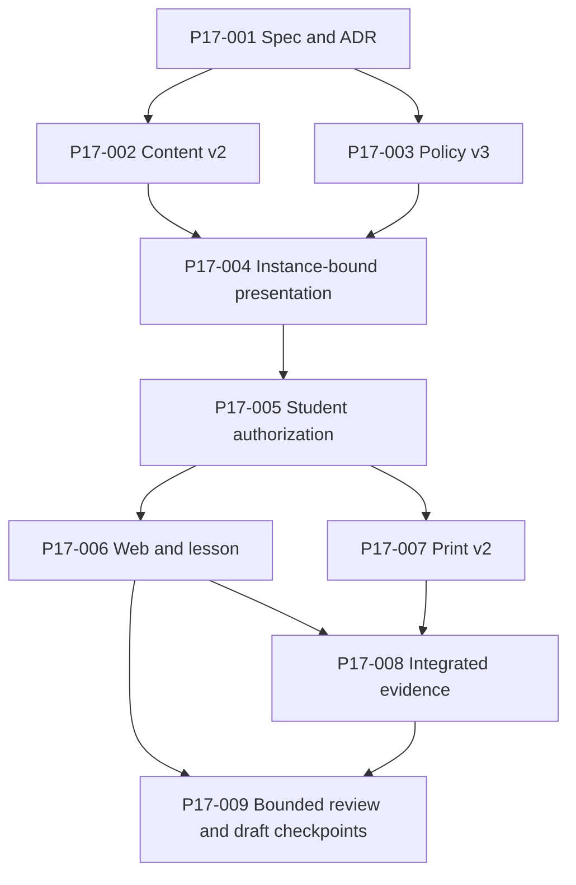

# Content-derived presentation v1 execution ledger

Status: in progress
Branch: `feat/prepared-answer-guard`
Base: `feat/v2-print-document` at
`129f35edcc7118a84f383dc16d1b8a575892e3dc` (parent draft PR #6)
Specification: [content-derived-presentation-v1.md](content-derived-presentation-v1.md)
Updated: 2026-08-02

## Delivery rule

This ledger is evidence-based. A task becomes complete only when its listed
contract, tests, and compatibility evidence exist on this branch. Documentation
intent is not implementation evidence. No task authorizes merge, deployment,
DNS changes, licensing decisions, or durable learner data.

The implementation uses parallel v2 contracts. Existing v1 schema identities,
validators, fixed vectors, artifacts, manifests, and public functions remain
available and byte-identical.

## Status summary

| Task | Outcome | Size | Dependencies | Status |
| --- | --- | --- | --- | --- |
| P17-001 | Freeze specification, ADR, contracts, and compatibility baseline | M | none | complete |
| P17-002 | Compile immutable ContentDocumentV2 revision 2 | L | P17-001 | complete |
| P17-003 | Add plan/registry v2 and policy v3 | L | P17-001; vector lock after P17-002 | complete |
| P17-004 | Materialize WorksheetPresentationV1 in WorksheetInstanceV2 | L | P17-002, P17-003 planner foundation | complete |
| P17-005 | Authorize detached StudentWorksheetDeliveryV2 | L | P17-004 | complete |
| P17-006 | Render Web worksheet v2 and standalone lesson | L | P17-005 | in progress — backend checkpoint only |
| P17-007 | Render PrintDocumentV2 and printable HTML | L | P17-005 | in progress — semantic core and prepared guard complete; HTML/A4 pending |
| P17-008 | Prove compatibility, artifacts, browser, and A4 gates | L | P17-006, P17-007 | pending |
| P17-009 | Independent review, final checks, and stacked draft PR | M | bounded checkpoints before P17-008; closeout after P17-008 | in progress — Web backend, print-semantic, and prepared-guard checkpoints only |

## Dependency graph

P17-006 and P17-007 can run in parallel after P17-005. A bounded, reviewable
backend checkpoint may enter P17-009 before P17-008, but that does not complete
P17-009 or Phase 1.7; final closeout still depends on P17-008. P17-002 and the
contract portion of P17-003 can run in parallel after P17-001; policy v3 cannot
be enabled or fixed-vector locked until P17-002 records the exact revision-2
source/content hashes.

## Frozen v1 baseline

Every value below must remain exact throughout Phase 1.7.

| Contract | SHA-256 or identity |
| --- | --- |
| revision-1 source | `79e734ec88fd0f5803c3063645726fb6934522a78ef79523112abd16dd3b78bb` |
| revision-1 ContentDocument | `336ce8c164c92f836f3ba6ab2f3c1ed0b7230433b950c8c39e6f01ce84d1fbb5` |
| fixed WorksheetInstanceV1 | `5252ef64b127638b785a94b3a2c7d1859cd7299e7032bed10aa41e07b2c4d12b` |
| student PrintDocumentV1 | `cd53a76b9c22c3a3e4af307f8d8bc19f60b9fd3845d5d4112637a2c5cb140c1f` |
| answer-key PrintDocumentV1 | `f69fcc570f557f163a1f08fb766a507afbd29bd987577e40aecc8ffef96d0ec3` |
| student printable HTML v1 | `2ff0c371d280373cfc48283e8839f9766f328f6dd23ec35a150e28012228c22d` |
| answer-key printable HTML v1 | `ac08a37f20b62a7ab2d7b1ca701b281c7124bc550db05ffc2175472fc6112aca` |
| policy-v2 12-minute preview | `preview-0ceccc181b16205f75577fb8fcae010433680890fab0bafa759e8cb5e6cd4d45` |
| policy-v2 12-minute base seed | `fe05015e60ae92979bbd77f1101c5789fa78fcfc0ad524268ef7eaff59102815` |
| policy-v2 arbitrary sample assignment | `sample-0d2e4f18c887611e9b4e6739ef1cb3697df8f2ef1bc2b2cbceb6c5f8773470ef` |
| policy-v2 arbitrary sample instance | `69d9c7ebe12ab40093f3d084015b02a0f658f57566176793501a6fd208a65888` |

## P17-001 — Specification and compatibility decision

- Status: complete
- Type: specification / architecture decision
- Size: M
- Dependencies: none
- Primary files:
  - `specs/content-derived-presentation-v1.md`
  - `specs/content-derived-presentation-v1.tasks.md`
  - `docs/decisions/0003-instance-bound-presentation.md`
- Deliverables:
  - frozen v2 schema/compiler/planner/presentation/Web/print identifiers;
  - exact bounded `explanation` and typed `worked-example` authoring syntax;
  - exact `WorksheetPresentationV1` and policy-v3 selection shapes;
  - failure, privacy, compatibility, response-budget, rollback, and deferred-
    scope contracts;
  - ADR explaining why new semantics use parallel v2 contracts rather than
    optional fields or changed literals under v1 identities.
- Completion evidence:
  - specification and task ledger are formatted and independently reviewed;
  - ADR agrees with the specification and existing architecture guardrails;
  - every reviewer finding is repaired or explicitly recorded before P17-002
    and P17-003 are treated as implementation-authoritative.
- Current evidence:
  - specification, ledger, accepted ADR, and project decision entry are
    formatted on the expected branch/base;
  - independent contract review approved after nine findings were repaired,
    including explicit compiler-v2 provenance, typed intermediates, single-
    owner normalization, request-v2 dispatch, exact error mapping,
    attribution, lesson flow, and generated-answer terminology.

## P17-002 — ContentDocumentV2 and compiler v2

- Status: complete
- Type: feature / tests
- Size: L
- Dependencies: P17-001
- Suggested ownership: content/schema lane
- Primary files:
  - `packages/schemas/src/content-document-v2.ts`
  - `packages/schemas/src/runtime-invariants.ts`
  - `packages/schemas/src/index.ts`
  - `packages/schemas/scripts/generate-json-schema.ts`
  - `packages/schemas/json-schema/content-document-v2.schema.json`
  - `packages/content-compiler/src/compiler.ts` or additive v2 module
  - `packages/content-compiler/src/compiler.test.ts`
  - `packages/content-compiler/scripts/compile-phase-1-content.ts`
  - `content/en/math/fractions/add-unlike-denominators.v2.md`
  - `content/compiled/math.fractions.add-unlike-denominators.v2.json`
- Deliverables:
  - strict source/AST/compiler v2 contracts;
  - compiler-owned canonical normalization of bounded plain-text explanation
    and worked-example paragraphs;
  - exact rational attribute parsing plus derived common-denominator/scaled-
    numerator intermediates and independent arithmetic equality validation;
  - additive generation/checking of both v1 and v2 artifacts;
  - fixed revision-2 source and content hashes recorded in this ledger.
- Completion evidence:
  - repeated v2 compilation is byte-identical;
  - hostile syntax, wrong results, unsafe bodies, and schema/version mismatches
    fail with bounded diagnostics;
  - checked-in v2 JSON Schema is current;
  - all v1 content hashes and bytes remain exact.
- Current evidence:
  - revision-2 source hash is
    `456c8908debd52c7fcc5eba6e2e9a38434b5fcd8343e7a14a427faae34502523`;
  - canonical revision-2 content hash is
    `944225a2dda87ae6ee61e53f21a929301f5264793d665ea2200b65fb0f5a71dd`;
  - compiler tests pass 222/222: 56 frozen-v1 and 166 v2 tests;
  - the v2 boundary rejects noncanonical rational source, unsafe prose,
    variable or missing container closing fences, one- and multi-column table
    syntax, Unicode White_Space normalization drift including U+0085, and
    directive-shaped lines altered by punctuation, noncanonical indentation,
    Unicode whitespace, controls, format characters, or default-ignorable
    characters before Markdown parser recovery;
  - content/compiler typecheck, schema generation, `content:check`, formatting,
    and independent foundation review pass while both frozen v1 hashes remain
    exact.

## P17-003 — Plan/registry v2 and policy v3

- Status: complete
- Type: feature / tests
- Size: L
- Dependencies: P17-001; final hash/vector lock depends on P17-002
- Suggested ownership: planner/policy lane
- Primary files:
  - `packages/planner/src/daily-plan-preview.ts` or additive v2 module
  - `packages/planner/src/daily-plan-preview.test.ts`
  - `packages/planner/src/index.ts`
  - preview shared contracts and fixtures under `apps/web/src/shared/`
- Deliverables:
  - request/plan/result/registry/response v2 contracts with strict v1/v2
    discriminator dispatch;
  - `day-one-fraction-preview@3` pinned to content revision 2, both hashes,
    compiler v2, the three fixed node IDs, and ordered `[1/2,1/3,5/6]`;
  - v2 seed and request-identity domains with complete version inputs;
  - unchanged 8/12/20 budget map and stable-prefix behavior;
  - exact `goal-unavailable` planner result, trusted resolution-error, and
    sanitized HTTP `preview_unavailable` mappings.
- Completion evidence:
  - final content hashes from P17-002 are literal policy inputs;
  - policy tuple order/length/value mutation tests fail closed;
  - v3 fixed plan/seed vectors are recorded;
  - all policy-v2 vectors in the frozen baseline remain exact.
- Current evidence:
  - the enabled final registry pins the exact P17-002 source/content hashes,
    compiler v2, reviewed count eight, three selected node IDs, and ordered
    `[1/2, 1/3, 5/6]` tuple;
  - the 12-minute v3 plan ID is
    `preview-d8e7bffb76e814cf8fed232ed5817008d9291247f94d4e63bda6fbeb647daf33`
    and its base seed is
    `338bee573add98fce96ae0616b008d002f1bb613bcbb805d6b291ce34bb1671f`;
  - planner tests pass 85/85, including frozen-v1/v2 type parity, detached
    snapshots, exact reviewed-count matching, and non-throwing lexical
    rational validation;
  - planner typecheck, formatting, and independent foundation review pass;
  - strict public request/response-v2 contracts and exact Hono v1/v2
    discriminator dispatch are implemented; v2 never falls through to v1 or
    changes lane from ambient registry state;
  - trusted planner, materializer, and projector test seams are detached and
    exact-replayed against independent trusted results before response;
  - presentation availability is limited to `content-identity-mismatch`,
    `invalid-selection`, `selected-node-count`, `selected-node-type`,
    `exercise-contract-mismatch`, `worked-example-arithmetic-mismatch`,
    `excluded-answer-tuple-mismatch`, and `presentation-invalid`;
    materialization availability is limited to `unsupported-content-state`,
    `locale-mismatch`, and `generation-exhausted`;
  - an injected unavailable outcome must match the trusted replay's exact
    reason kind and code. Presentation `unsafe-input`/`invalid-content`,
    materialization `unsafe-input`/`invalid-assignment`/`invalid-instance`, and
    future unclassified codes remain exceptions; the route reports only a fixed
    sanitized 500 classification without raw exception or request data;
  - all policy-v2 frozen vectors remain exact.

## P17-004 — Presentation resolver and WorksheetInstanceV2

- Status: complete
- Type: feature / tests
- Size: L
- Dependencies: P17-002, P17-003
- Suggested ownership: schema/generator integration lane
- Primary files:
  - planned `packages/schemas/src/worksheet-instance-v2.ts`
  - `packages/schemas/src/runtime-invariants.ts`
  - `packages/schemas/scripts/generate-json-schema.ts`
  - planned `packages/schemas/json-schema/worksheet-instance-v2.schema.json`
  - `packages/generators/src/fraction-addition.ts` or additive v2 module
  - `packages/generators/src/fraction-addition.test.ts`
- Deliverables:
  - pure strict `WorksheetPresentationV1` resolver;
  - exact content/hash/node/type/exercise/tuple validation with no fallback;
  - detached presentation copied from compiler-normalized strings;
  - strict compiler-v2 `ContentReferenceV2`, `SlotProvenanceV2`, and
    `WorksheetSlotV2` rather than compiler-v1 provenance reuse;
  - `WorksheetInstanceV2`, materialized canonical bytes, and instance hash;
  - runtime relationships between presentation, top-level content, slots,
    instruction, provenance, generator, and excluded answers.
- Completion evidence:
  - identical inputs yield byte-identical v2 instances;
  - every schema-valid selected presentation/content change changes v2
    identity, while an in-place mutation of a fixed node ID is rejected;
  - wrong/missing/duplicate node and content/tuple mismatch fixtures fail before
    an instance is returned;
  - fixed v2 instance vector is recorded;
  - fixed WorksheetInstanceV1 remains exact.
- Current evidence:
  - the additive WorksheetPresentationV1/WorksheetInstanceV2 schema lane and
    checked-in JSON Schema are implemented; 43 focused tests pass, including
    exact prompt-sum/canonical-answer parity, and all 280 schema tests pass
    after P17-005 with schema check and TypeScript 7 typecheck;
  - every v2 rational-bearing slot field uses a lexical gate before exact
    rational refinement, and schema-level content/presentation/provenance,
    instruction, generator, arithmetic, exclusion, duration, scoring, and
    uniqueness relationships fail closed;
  - the pure resolver passes 36 focused tests for exact content and node
    selection, arithmetic, ordered exclusions, safe-data detachment, strict
    envelope keys, and bounded typed errors;
  - the materializer passes 36 focused tests for deterministic planner-owned
    4/6/8 stable prefixes, same-document presentation/attribution/provenance,
    broad-seed exclusions, pre-await caller detachment, hostile opaque values,
    and complete-plan authorization;
  - materialization accepts one detached `DailyPlanPreviewV2`, reruns the pinned
    planner and final registry from its request-defining fields,
    canonical-compares the complete expected plan before content hashing or
    generation, and derives every assignment, policy, graph, seed, selection,
    content, and item-count claim from that authorized snapshot;
  - the fixed planner-derived 12-minute WorksheetInstanceV2 hash is
    `934bd3949b6284bbb4061a29b3075560f9389b096ec4f913ad56788e06ac0d02`;
  - all 91 generator tests pass, including 19 frozen-v1 tests and the exact v1
    instance hash; exact prompt-sum acceptance and all historical v1 bytes
    remain unchanged.

## P17-005 — StudentWorksheetDeliveryV2 authorization

- Status: complete
- Type: security boundary / tests
- Size: L
- Dependencies: P17-004
- Suggested ownership: privacy/correctness lane
- Primary files:
  - `packages/schemas/src/student-worksheet-delivery-v2.ts`
  - `packages/schemas/src/student-worksheet-delivery-v2.test.ts`
  - `packages/schemas/src/trusted-student-projection.ts`
  - `scripts/check-import-boundaries.mjs`
  - `scripts/import-boundary-policy.mjs`
  - `scripts/check-import-boundaries.test.mjs`
  - shared and projector regression tests
- Deliverables:
  - strict answer-free `StudentWorksheetDeliveryV2` with presentation;
  - trusted v2 canonical-answer context available only to server projectors;
  - one detached pre-await snapshot for hash, authorization, and emission;
  - no operand exception for lesson/worked-example fields;
  - explicit rational-equality checks for the derived intermediate pairs
    `leftScaledNumerator/commonDenominator`,
    `rightScaledNumerator/commonDenominator`, and
    `unreducedSumNumerator/commonDenominator`, rather than relying on scans of
    their separate integer fields;
  - final shared-boundary answer scans over presentation, global, and practice
    data;
  - detached trusted answer context for the final Web and print scans owned by
    P17-006 and P17-007, without claiming those downstream projections here.
- Completion evidence:
  - answer injection in every presentation field fails before delivery;
  - source/materialization mutation and accessor regressions fail or use the
    detached snapshot consistently;
  - browser-reachable trusted-subpath import tests pass;
  - v1 student projection behavior and bytes remain exact.
- Current evidence:
  - the strict v2 delivery retains the complete committed presentation and
    allowlisted student practice fields while omitting plan, policy, content,
    RNG/seed, canonical answer, scoring, solution, and misconception fields;
  - one safe-data-checked, detached pre-await snapshot supplies canonical-byte
    comparison, SHA-256 verification, emission, authorization, and detached
    trusted answers; caller mutation of the instance and envelope during the
    hash cannot mix snapshots;
  - all presentation/global roles receive all-answer scans, practice keeps
    only the V1 structured cross-slot operand exception, and all three
    displayed intermediate pairs are reconstructed and compared by bounded
    exact rational equality;
  - `WorksheetInstanceV2` now rejects a canonical answer that differs from the
    exact prompt sum even when scoring and the final solution are changed to
    agree with that wrong answer;
  - 75 focused delivery tests and all 280 schema tests pass; the shared
    answer-disclosure scan handles raw, NFKC, form-space, and repeated
    URI-component encoding at depths 0, 1, 2, 3, and 32 with a deduplicated
    closure capped at 24 value-and-round states and three URI-decode rounds,
    including composed URI-to-NFKC-to-URI forms, mixed ASCII/fullwidth plus,
    `%25%32%46`, and raw-vs-collapsed decode forms. Canonical common outer
    wrappers are compressed without losing relative percent depth, then the
    current and independently percent-collapsed values are decoded as separate
    branches. Regression vectors include `%2539%2F35`,
    `%252539%252F35`, malformed `%ZZ` and truncated UTF-8 suffixes, the benign
    `%2538%2F35`, and cross-slot `%25113%2F70`; either cap fails closed rather
    than accepting a partial closure;
  - two V1 compatibility regressions prove that the attribution schema remains
    the same runtime object across root, safe-leaf, presentation, and worksheet
    exports rather than merely remaining structurally equivalent;
  - the Vite/Oxc boundary suite passes 67/67 plus the live repository scan. It
    enforces exact browser-safe public leaf imports and exact transitive source
    dependencies, along with the reviewed manifests, scripts, complete
    lockfile/workspace, Vite/Wrangler/PostCSS, HTML/CSS assets, and executable
    source surfaces;
  - final Rollup `OutputChunk.modules` provenance rejects server, Worker,
    generator, and unreviewed workspace contributors after bundling; a bounded
    post-build canary then scans every regular emitted file for protected
    answer, seed, scoring, and solution-trace tokens. The artifact walk rejects
    symbolic links and non-regular entries and fails closed above 1,000 total
    entries, 20 MiB of regular-file content, or depth 16. Focused integration
    coverage passes 37/37 provenance tests and 24/24 scanner tests;
  - the raw token canary is defense in depth, not semantic absence proof.
    Tree-shaking is an optimization, not an authorization boundary; source
    reachability and final emitted-module provenance are separate gates;
  - successive exact reviews and real Vite 8.1.5 builds regression-lock the
    compiler-partition, trusted-module, resolver, package metadata, HTML, CSS,
    and test-only edge classes;
  - successive exact-diff reviews reproduced mixed percent-encoding answer
    leakage, a raw-vs-collapsed URI-decode branch loss, and an extensionless
    Vite-module enumeration bypass; all now have red/green integration
    regressions, but P17-009 still requires a fresh review of the final frozen
    diff rather than reusing any earlier verdict;
  - repository formatting, TypeScript 7.0.2, schema/content checks, production
    build, and sample artifact verification pass;
  - the v1 Web/PrintDocument/HTML content addresses remain byte-identical.

## P17-006 — Web worksheet v2 and standalone lesson

- Status: in progress — strict worksheet DTO/projector/service/API backend
  checkpoint complete; lesson, React, and browser acceptance pending
- Type: feature / accessibility / tests
- Size: L
- Dependencies: P17-005
- Suggested ownership: Web lane; parallel with P17-007
- Product-alignment gate:
  - the current local Web page is a technical prototype, not an accepted
    product or visual direction;
  - before opinionated page structure, navigation, copy hierarchy, or visual
    styling changes, align with the owner on primary learners, daily workflow,
    information architecture, and design references;
  - DTO, service, privacy, determinism, and renderer-neutral component tests
    may proceed before that conversation, but current hard-coded layout must
    not shape the canonical presentation contract.
- Primary files:
  - `packages/web-renderer/src/model.ts`
  - `packages/web-renderer/src/worksheet-view.tsx`
  - `packages/web-renderer/src/fraction-bar-explorer.tsx`
  - Web renderer tests/fixtures/styles
  - `apps/web/src/shared/daily-plan-preview-contract-v2.ts`
  - `apps/web/src/worker/web-worksheet-projector-v2.ts`
  - `apps/web/src/worker/daily-plan-preview-service-v2.ts`
  - V2 contract/projector/service/API tests and `apps/web/src/worker/app.ts`
  - lesson service/route and existing sample/preview services
  - `apps/web/src/react-app/App.tsx`
  - lesson loader, shared limits, and browser/React tests
- Deliverables:
  - strict `web-worksheet.v2` and `web-lesson.v1` DTOs;
  - one shared presentation view for lesson and worksheet;
  - v2 projectors with no application-owned reviewed-example constant;
  - exact model-driven fraction-bar operands/common denominator;
  - accountless lesson path independent of worksheet generation;
  - 16 KiB lesson transport using the existing bounded strict decoder;
  - updated preview/sample response-v2 and producer-budget coverage.
- Completion evidence:
  - lesson/student/key presentations deep-equal and expose the same source
    identity;
  - forced generator failure does not make the lesson unavailable;
  - no protected field/value appears in student data or DOM;
  - keyboard, accessibility, cancellation/race, desktop, and 390 px tests pass;
  - preview/sample limits remain 32/64 KiB with deliberate headroom.
- Current evidence:
  - strict `web-worksheet.v2` validation and model projection are implemented;
    prompt rationals are canonical/reduced with positive denominators, and
    prompt accessibility text is re-derived exactly from typed operands;
  - the Worker projector consumes detached trusted answers, performs a final
    answer-disclosure authorization after validation, and the application
    service exact-replays injected planner, materializer, and projector outputs
    rather than trusting schema-valid substitutes. Only the explicit reviewed
    availability-code allowlists become generic unavailability, and an injected
    unavailable reason must exactly match trusted replay; defect and future
    unclassified codes remain exceptions;
  - `POST /api/plans/preview` dispatches exact request-v1/response-v1 and
    request-v2/response-v2 lanes, enforces one exact 32 KiB serialization cap,
    and returns structured sanitized errors;
  - the reviewed 365-day corpus has a maximum V2 response of 5,964/32,768
    bytes, leaving 26,804 bytes headroom;
  - production browser privacy has three gates: exact safe source leaves, final
    Rollup `OutputChunk.modules` provenance, and a protected-token canary over
    every regular emitted file. The canary is defense in depth, not semantic
    absence proof; tree-shaking is not an authorization boundary;
  - the production client records 112 modules and the raw scanner covers
    328,591 artifact bytes;
  - the active React `/new` path still uses V1. `web-lesson.v1`, shared lesson
    presentation UI, React V2 integration, and browser/visual/accessibility
    tests remain pending, so P17-006 is not complete.

## P17-007 — PrintDocumentV2 and printable HTML

- Status: in progress — renderer-neutral semantic core and prepared answer
  guard complete; printable HTML, artifacts, and rendered A4 evidence pending
- Type: feature / privacy / layout tests
- Size: L
- Dependencies: P17-005
- Suggested ownership: print lane; parallel with P17-006
- Primary files:
  - `packages/print-document/src/types-v2.ts`
  - `packages/print-document/src/validate-v2.ts`
  - `packages/print-document/src/canonical-v2.ts`
  - `packages/print-document/src/project-v2.ts`
  - `packages/print-document/src/index.ts`
  - `packages/print-document/src/__tests__/v2-fixture.ts`
  - `packages/print-document/src/validation-v2.test.ts`
  - `packages/print-document/src/canonical-v2.test.ts`
  - `packages/print-document/src/project-v2.test.ts`
  - `packages/print-document/src/compatibility-v1.test.ts`
  - `packages/schemas/src/worksheet-instance-v1.ts`
  - `packages/schemas/src/equivalent-fraction-leak.test.ts`
  - `scripts/import-boundary-policy.mjs`
  - `scripts/check-import-boundaries.test.mjs`
  - printable V2 HTML implementation and render tests in the next slice
- Deliverables:
  - separate `PrintDocumentV2` validator/canonical/projector entrypoints;
  - presentation heading, paragraphs, and structured worked-example blocks
    before practice;
  - identical presentation blocks in student and answer-key variants;
  - student projection solely from answer-free delivery;
  - final role-sensitive presentation leak checks;
  - escaped, accessible printable HTML with reviewed A4 behavior.
- Completion evidence:
  - v2 student/key PrintDocument and HTML hashes are recorded;
  - semantic snapshot parity with Web/lesson passes;
  - injected presentation answers fail final print authorization;
  - all four current v1 PrintDocument/HTML hashes remain exact.
- Current semantic-core evidence:
  - schema `exercisebook.print/v2`, source schema
    `exercisebook.worksheet-instance/v2`, and projector `print-projector.v2`
    have separate V2 validation, canonicalization, student, and answer-key
    entrypoints without widening V1;
  - one unsafe-graph-checked, detached pre-await materialization snapshot owns
    canonical-byte, hash, source, student, and key decisions. Student and common
    key blocks consume only `StudentWorksheetDeliveryV2`; key entries alone read
    the same verified full instance;
  - the package root selectively exports the reviewed V2 contract,
    canonicalizer, validator, projectors, and worksheet verifier. Direct
    document materialization, block internals/resource limits, and final trusted
    authorization remain private;
  - structural validation is not authorization. Only the verified projection
    path binds a document to its source and performs final role-sensitive
    student authorization; an external request additionally depends on trusted
    application-service replay;
  - production print source may import only exact `@exercisebook/domain`,
    `@exercisebook/schemas`, and
    `@exercisebook/schemas/trusted-student-projection` roots plus relative
    package modules. Planner, generator, compiler, unreviewed subpath, and
    test-only imports fail the boundary;
  - the trusted subpath exposes an opaque prepared guard that validates and
    detaches canonical answers once and precomputes complete/per-slot
    signatures in O(N). Browser reachability checks reject the binding; the
    legacy root one-shot assertion remains behavior-compatible;
  - one prepared assertion has a 4,096-candidate cap across structured and
    recognized-text rationals, and the phase shares an 8,192-candidate cap.
    End-to-end production Web/Print projection entrypoints have two fixed
    authorization phases, and the replay-authorized V2 service path has three;
    these are not request-wide or whole-CPU bounds;
  - the schema-valid, unique-answer boundary fixture consumes 6 candidates in
    delivery and `12 + 10N` in the final Print phase, or `18 + 10N` across both
    direct V2 phases. At N=200 the heavier phase consumes 2,012/8,192 and the
    two-phase total is 2,018. Prepared trusted/full V2 p50 is 7.13/30.08 ms at
    N=100 and 13.48/56.63 ms at N=200. These are local Apple M5 Pro / Node
    26.5.0 reference measurements after 3 warmups and across 15 measured runs,
    not a CI latency or SLO gate; deterministic counters and tests are the
    regression evidence. Answer-guard BigInt conversions across trusted
    delivery and final Print authorization are `24N + 36`: 4,836 at N=200
    versus the former guard-only 487,636 baseline, about 100.8x fewer.
    Validation and canonicalization conversions are outside this structural
    count;
  - the fixed V2 worksheet instance hash is
    `934bd3949b6284bbb4061a29b3075560f9389b096ec4f913ad56788e06ac0d02`;
  - the student PrintDocument hash is
    `51892552e00caac748d0ceb2532ed7eb1d7a1e094eef887cb0cc941fd8f80111`
    at 12,077 canonical bytes, leaving 3,987,923 bytes beneath the
    4,000,000-byte cap;
  - the answer-key PrintDocument hash is
    `d5a5b226bb485ed8e3cb8a43ef05695015e2a00bb97fe6a85530c654b7db0ebd`
    at 16,012 bytes, leaving 3,983,988 bytes;
  - the aggregate `pnpm check` is green with TypeScript 7.0.2 and 1,315/1,315
    Vitest tests across 48 files. Focused evidence is 143/143 print-package
    tests across 10 files, 358/358 schema tests across 5 files (including
    162/162 schema-contract tests), 75/75 equivalent/prepared-guard tests, 67/67
    source/config boundary tests plus the live scan, 37/37 final
    module-provenance tests, and 24/24 artifact-scanner tests. Production build
    and existing sample verification pass without identity changes; the
    production client records 112 modules and the scanner covers 328,591 bytes;
  - the real V1 pipeline freezes the WorksheetInstance, student/key
    PrintDocument, and student/key HTML identities listed in the baseline table.
- Remaining before P17-007 completion:
  - `renderPrintableHtmlV2` and a complete V2 print-semantic snapshot;
  - V2 HTML hashes plus checked-in artifacts/manifests;
  - standalone lesson/Web/print semantic snapshot parity;
  - decide the effective materialization envelope separately from the prepared
    guard: a generated-style payload passes N=178 at 548,377 canonical bytes
    and fails N=179 at 551,466 bytes because complete safe-graph inspection
    exceeds the 1,000,000 string-code-unit cap. This is a follow-up contract
    decision, not a guard failure;
  - establish request-wide runtime/failure budgets before a public synchronous
    render endpoint. The implemented fixed phase caps do not constitute a
    whole-request CPU or memory guarantee;
  - browser-rendered A4 page count, clipping, page-break, extracted-text,
    accessibility, and working-space evidence. The semantic `paper: "a4"`
    discriminator is not that evidence.

## P17-008 — Integrated compatibility and release evidence

- Status: pending
- Type: integration / QA
- Size: L
- Dependencies: P17-006, P17-007
- Suggested ownership: integration/QA lane
- Primary files:
  - sample writers/renderers/verifier under `apps/web/scripts/` and `scripts/`
  - additive v2 golden fixtures/manifests
  - package integration tests and roadmap/status documentation
- Deliverables:
  - non-colliding v2 Web and print sample artifacts/manifests;
  - an explicit v1 compatibility test for every frozen baseline value;
  - v2 source/content/plan/seed/instance/Web/Print/HTML vector table;
  - full static, content, schema, boundary, dependency, build, and artifact
    evidence;
  - production-bundle browser smoke on lesson, 8/12/20 preview, student,
    answer-key, and print flows;
  - visual and extracted-text inspection for both A4 variants.
- Completion evidence:
  - `pnpm check`, `pnpm audit --audit-level high`, `pnpm dedupe --check`, and
    `git diff --check` pass;
  - v1 and v2 artifacts verify by content address;
  - browser requests succeed without console errors, storage/cookie writes,
    protected DOM values, horizontal overflow, or print regeneration;
  - exact page counts, clipping/read-order result, response maxima, and all v2
    hashes are recorded in this ledger.
- Current partial evidence:
  - the aggregate `pnpm check` is green with TypeScript 7.0.2 and 1,315/1,315
    Vitest tests across 48 files. Focused evidence is 143/143 print-package
    tests across 10 files, 358/358 schema tests across 5 files (including
    162/162 schema-contract tests), 75/75 equivalent/prepared-guard tests, 67/67
    source/config boundary tests plus the live scan, 37/37 final
    module-provenance tests, and 24/24 artifact-scanner tests. Production build
    and existing sample verification pass without identity changes; the
    production client records 112 modules and the scanner covers 328,591 bytes;
  - prepared trusted/full V2 p50 is 7.13/30.08 ms at N=100 and 13.48/56.63 ms
    at N=200. These are local Apple M5 Pro / Node 26.5.0 reference measurements
    after 3 warmups and across 15 measured runs, not a CI latency or SLO gate;
    deterministic counters and tests are the regression evidence. Structural
    instrumentation reduces N=200 answer-guard
    BigInt conversions across trusted delivery and final Print authorization
    from 487,636 to 4,836. Validation/canonicalization conversions are outside
    that count. These measurements address repeated answer preparation, not the
    separate request-wide runtime or materialization envelope gates;
  - revision-1/revision-2 content hashes and every frozen V1
    WorksheetInstance/PrintDocument/HTML identity remain unchanged under an
    explicit real-pipeline compatibility test;
  - the V2 instance and student/key semantic PrintDocument identities and
    canonical byte sizes are recorded under P17-007;
  - the 2026-08-02 `pnpm audit` run reported no known vulnerabilities after
    patching the Cloudflare development stack to
    `@cloudflare/vite-plugin@1.49.0`,
    `@cloudflare/vitest-pool-workers@0.19.1`, `wrangler@4.116.0`, and resolved
    `miniflare@4.20260730.0` / `sharp@0.35.2`;
  - these checks support the Web backend and print semantic checkpoints only.
    Printable V2 HTML and checked-in artifacts, standalone lesson/React browser
    flows, visual/accessibility inspection, and rendered A4 evidence are
    missing, so P17-008 remains pending.

## P17-009 — Independent review and stacked draft PR

- Status: in progress — bounded Web backend, print-semantic, and prepared-guard
  checkpoints only; Phase 1.7 closeout remains dependent on P17-008
- Type: review / delivery
- Size: M
- Dependencies: bounded checkpoints after the P17-006 backend subset and
  P17-007 semantic core; full closeout after P17-008
- Suggested ownership: independent reviewers then coordinator
- Deliverables:
  - independent versioning/contract review;
  - independent adversarial privacy/snapshot review;
  - independent Web/lesson/print accessibility and release-readiness review;
  - repaired findings and rerun focused/full gates;
  - focused commits pushed to `feat/prepared-answer-guard`;
  - bounded stacked draft PR targeting `feat/v2-print-document`;
  - final Phase 1.7 review and release checkpoint after P17-008.
- Completion evidence:
  - clean worktree and exact local/remote/head SHA agreement;
  - draft/open/base/head/mergeability readback;
  - successful final CI for the final pushed SHA;
  - no merge, deployment, DNS, or license mutation;
  - remaining findings recorded as explicit next-loop work.
- Current evidence:
  - the aggregate `pnpm check` for the bounded Web backend, print semantic core,
    and prepared guard passes with the exact counts recorded under P17-008;
  - the branch is stacked on `feat/v2-print-document` at
    `129f35edcc7118a84f383dc16d1b8a575892e3dc` (parent draft PR #6), with no
    merge or deployment;
  - no child draft PR has been created at this documentation checkpoint;
  - child draft-PR state, exact local/remote head agreement, and final CI are
    volatile GitHub evidence that must be read back at delivery time rather than
    inferred from this ledger; a bounded draft checkpoint still does not
    complete P17-009 or Phase 1.7.

## Execution lanes

| Lane | Tasks | Start condition |
| --- | --- | --- |
| Contract coordinator | P17-001, P17-004 integration, bounded P17-009 checkpoints, P17-008/final P17-009 | immediate |
| Content/schema | P17-002 | P17-001 reviewed |
| Planner/policy | P17-003 | P17-001 reviewed; hashes finalize after P17-002 |
| Privacy boundary | P17-005 | P17-004 complete |
| Web/lesson | P17-006 | P17-005 complete |
| Print | P17-007 | P17-005 complete |
| Independent QA/review | P17-008 review support, P17-009 | integrated slice available |

Agents working in parallel share one worktree. Each lane must announce its file
ownership before editing, avoid unrelated changes, and hand back exact tests and
remaining risks. The coordinator owns cross-lane integration and all commits.

## Deferred findings that remain visible

- public catalog, trusted release manifest, licenses, deployment, and DNS;
- endpoint abuse controls and complete production headers;
- exact Generator manifest/entry coverage and narrower trusted Worker
  dependency/source-root allowlists; these improve server-graph reproducibility
  but are not required for the current answer-free browser DTO boundary;
- exact rational answer submission and formative feedback;
- evidence/mastery, accounts, persistence, hosted PDF, and LuaLaTeX;
- generalized presentation nodes, localization, richer authoring, and other
  worked-example models;
- answer-key source/target solution-string bound reconciliation unless changed
  by this slice.
- semantic answer review beyond the bounded rational scanner, including decimal,
  percentage, and natural-language equivalents in authored presentation.
